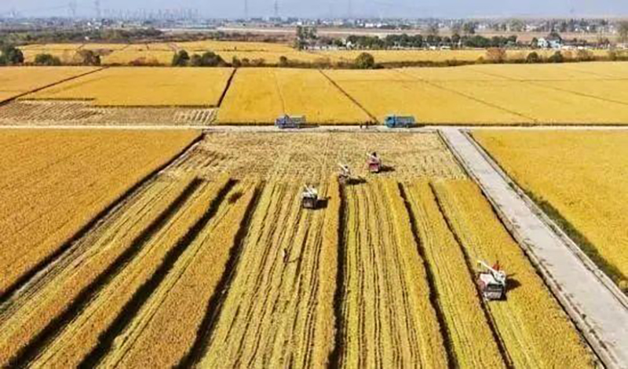
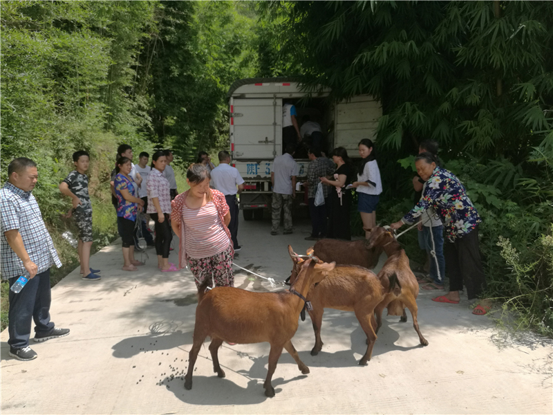

# 国家密集型推进区块链农业技术

----------

## 摘要

区块链+农业将会成为当今世界供应链新革命。今年中央一号文件明确指出：“依托现有资源建设农业农村大数据中心，加快物联网、大数据、区块链、人工智能、第五代移动通信网络、智慧气象等现代信息技术在农业领域的应用。”首次把区块链放在了人工智能和5G的前列，同时也指出区块链的应用场景涵盖了农产品物流、溯源、供应链管理等多个领域。

除了一号文件，农业农村部办公厅还印发《2020年乡村产业工作要点》。其中提到，要以信息技术带动业态融合，促进互联网、物联网、区块链、人工智能、5G、生物技术等新一代信息技术与农业融合，发展数字农业、智慧农业、信任农业、认养农业、可视农业等业态。

## 分析

农业是世界上最大的就业部门，为当今世界40%的人口提供生计，是贫困农村家庭最大的收入和就业来源。根据联合国可持续发展目标SDG2指导，到2030年要实现农业生产力翻倍以及农民收入翻番。然而，作为地球上最古老的一个行业，农业的发展相对于其他行业明显要慢得多，产业链条漫长、经营主体高度分散等问题也限制了其转型升级的步伐。

区块链作为一种分布式存储数据库技术，具备去中心化，不可篡改及可追溯的特征。分布式账本可以记录和更新作物从种植、管护到收获、储运、加工、交付等个环节的状态，共享式的记录，可以保障农业数据不会丢失，且能做到实时查询。其与农业的结合将有利推动后者的更快发展。区块链应用于农业的最大价值在于最大限度地消除信息不对称，提高整个产业链的信息透明度和及时反应能力，从而实现产业增值，为农业从业者带来直接经济价值。

以此次疫情为例，由于信息不对称，期间一些贫困地区农产品受疫情防控隔离措施影响销售不畅，收入锐减，而城市居民日常购买蔬菜、水果却困难重重。如果农产品供应链上各环节都能加入到基于区块链的溯源体系中来，再通过大数据，将产品滞销与购买困难信息进行匹配，两个问题都将得到很好的解决。

## 比较案例

> 四川省南江县“借羊还羊”产业扶贫案例

产业扶贫过程中，经常出现贫困户对无偿捐赠发放的禽畜私自出售甚至杀食享用等现象，导致扶贫效果不佳。四川省南江县探索出的“借羊还羊”产业扶贫模式有效解决了上述问题，是一种“授渔”的可持续扶贫模式。该案例被入选为由世界银行、联合国粮农组织、国际农业发展基金、联合国世界粮食计划署、亚洲开发银行、中国国际扶贫中心和中国互联网新闻中心联合发起“全球减贫案例征集活动”的最佳案例。

“借羊还羊”是指由当地扶贫企业（中国工商银行驻四川省南江县定点扶贫工作组）出资购买优质能繁母羊，并“借”给村里有养殖意愿和能力的贫困户饲养，养殖收益归贫困群众所有，养殖两年后贫困户再将所借黄羊“还”给村集体，再由村集体“借”给其他贫困群众饲养，滚动发展；此外，倡导项目村引进专业养殖大户集中“托管代养”，没有养殖能力的贫困户可以入股分红。

南江黄羊养殖产业扶贫模式解决了贫困户发展产业面临的资金和技术难题，更重要的是带动了贫困户发展生产的积极性，也推动了南江黄羊产业规模化、专业化发展。该模式具有较强的可操作性和可复制性，易于推广，各地可结合当地特色资源开展“借畜还畜”项目，或者通过发展产业大户统一代种代养，助力贫困群众脱贫奔康

## 图片

## 标签

消除贫困（SDG1）、可持续农业（SDG2）

 