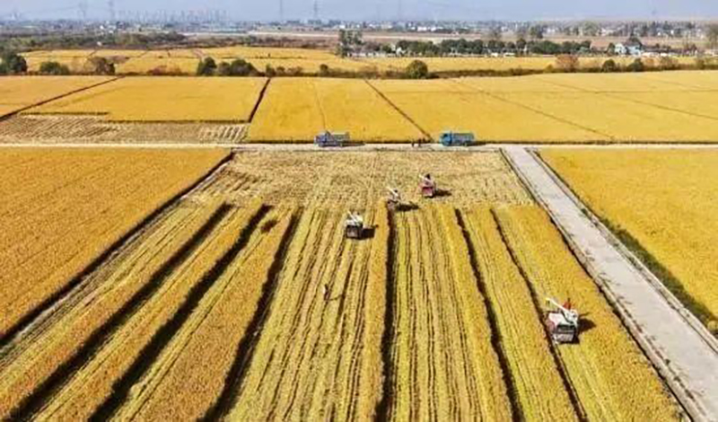

# State-Intensive advances in Agriculture Blockchain

----------

## Abstract

Blockchain + agriculture will become a new revolution in the supply chain in the world today.This AA year's No.1 document of the Central Committee clearly pointed out: " Relying on existing resources to build agricultural and rural big data centers, we accelerate the application of modern information technologies such as the Internet of Things, big data, blockchain, artificial intelligence, fifth-generation mobile communication network and smart meteorology in the agricultural field."For the first time, blockchain was placed at the forefront of AI and 5G, and it also pointed out that the application scene of blockchain covers agricultural products logistics, traceability, supply chain management and other fields.

In addition to the No.1 document, the General Office of the Ministry of Agriculture and Rural Affairs also issued the Key Points of Rural Industry Work in 2020.It is mentioned that information technology should be the way to drive the integration of business forms, promote the integration of new-generation information technologies, such as the Internet, the Internet of Things, blockchain, artificial intelligence and 5G, biotechnology, with agriculture, and develop digital agriculture, smart agriculture, trust agriculture, adoption agriculture and visual agriculture.

## Analysis

Agriculture is the world's largest employment sector, providing livelihoods to 40% of the world's population today, and is the largest source of income and employment for poor rural families.According to the SDG2 guidance of the United Nations Goals for Sustainable Development, we will double agricultural productivity and double farmers' income by 2030.However, as the oldest industry on the earth, the development of agriculture is significantly slower than other industries. Problems such as the long industrial chain and the high dispersion of operating entities also limit its pace of transformation and upgrading.

As a distributed storage database technology, blockchain has the characteristics of decentralization, untampered ability and traceability.Distributed ledger can record and update the status of crops from planting, management to harvest, storage and transportation, processing and delivery. Shared records can ensure that agricultural data will not be lost, and the query can be made in real time.Its combination with agriculture would be advantageous to drive the faster development of the latter.The maximum value of blockchain application to agriculture lies in to maximize the elimination of information asymmetry, improve the information transparency and timely response ability of the whole industrial chain, so as to realize industrial appreciation and bring direct economic value to agricultural practitioners.

Take this epidemic as an example. Due to the information asymmetry, the sales of agricultural products in some poor areas were not smooth when affected by the epidemic prevention and control and quarantine measures, and the income decreased sharply, while it was difficult for urban residents to buy vegetables and fruits daily.If all links of the agricultural product supply chain can be added to the block chain-based traceability system, and then match the unsalable products with the difficult purchase information through big data, both problems will be well solved.

## Pictures

----------
 
