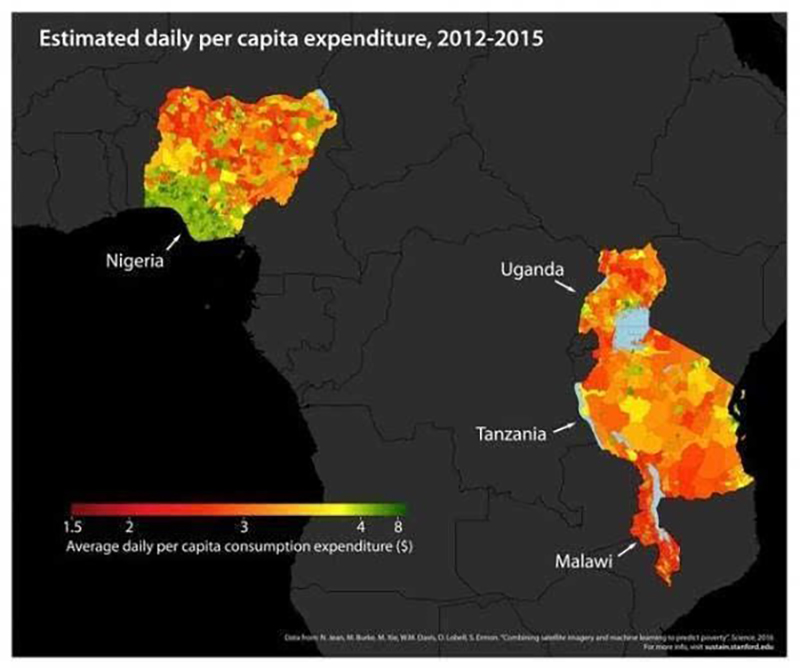
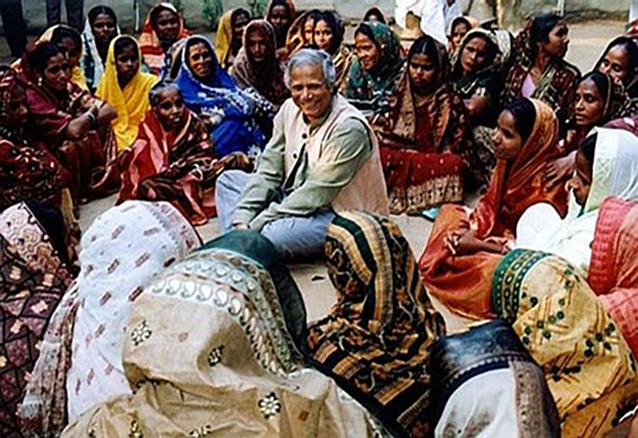

# Using machine learning plus satellite, Stanford can identify poor areas from space

----------

## Abstract

In many third world countries, a full set of economic variables is hardly available and extremely unreliable due to weak infrastructure and a lack of cooperative ability to collect data and share data.However, the lack of high-quality data hinders economic development in the region.

However, this situation currently has a chance to change.Scientists from the Stanford University Center for Computer Research have found a new way to accurately identify poor areas (published Aug. 1 8 in Science), using machine learning with satellite images to successfully identify the economic conditions of five African countries.

An examination of the intensity of nighttime lighting is not a fashionable indicator of measuring the level of economic activity in a region.But for extremely poor areas, it is difficult to judge directly from the night lighting situation.Because judging from satellite images, the night is equally dark in most extreme poverty areas of Africa.

The novelty of Stanford's study is the use of a machine learning technology called "transfer learning" to identify poverty in two steps.First, models were built to predict night lighting by machine deep learning of about 4,096 economically related indicators in high-resolution daytime satellite images, including roads, downtown, and waterways.Then, combined with the Population Health Organization and the World Bank's existing research, the model will be modified to complete the identification of poverty.

In this way, the prediction of regional poverty level can achieve levels of 81% -99% accuracy, which can help economic aid organizations manage and distribute materials more efficiently, reducing aid costs while helping more poor people.

## Analysis

Poverty has become one of the long-standing dilemmas facing human civilization in the 21st century. According to world development indicators, about 42 percent of the world's population and nearly 2.6 billion people are living in poverty.An important premise for eliminating poverty is to identify poverty. As the case says, in economically backward countries and regions, governments are difficult to afford high economic research costs, some of which are still in political turmoil, and data on poverty is highly missing.This poses no big obstacle to international aid.

Compared to traditional door-to-door surveys, the machine learning method combined with satellite imagery greatly reduces survey costs, and the data access channels almost all come from public information, making this method easier to generalize and replicate.

## Pictures

----------
 
 
