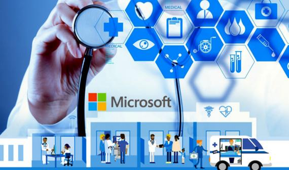

# 新冠疫情世界里的人工智能

----------

## 摘要

在新冠疫情肆虐的今天，全球仍有 40 亿人无法获得应有的医疗健康服务。人工智能技术的发展，必将带来更为公平的解决方案。微软推出首个行业云解决方案“微软医疗云”（Microsoft Cloud for Healthcare）——这一方案以微软现有的与医疗卫生行业需求和场景相关的所有云服务为基础构建而成，能够满足医疗行业的主要需求，包括改善病患沟通、加强医疗团队协作、提升运营和诊疗数据洞察，并确保云计算的互操作、安全、可信。

## 分析

看病难、看病贵的问题在中国十分突出，主要表现在两大方面，一是医疗资源分配不均。据统计，三级医院拥有目前医疗服务体系中近90%的高新设备和优秀医疗人员，基层医院的医疗设备严重不足、医生密度偏小、业务水平不高，限制了其诊疗能力，往往需要将患者转诊到大医院进行后续诊疗或采取保守治疗；二是基层医院门可罗雀，但三级医院和门诊日日人满为患，较低的医患比例使医生长期处在高压状态，医患关系紧张、纠纷频发。此外，结合本次突发新冠疫情，在应急状态下，依靠传统医疗模式无法应对“战时”医疗系统的峰值压力。

面对以上状况，通过供给侧改革，除增加医疗资源供给外，利用AI技术赋能，提高医疗资源的使用效率是快速缓解当下医疗资源不足的有效途径之一：

一，通过AI算法辅助医生诊疗，可大幅减轻医生负担，将所释放的精力和时间处理更紧急的事件、诊治更多的病患、与病患做更专注的交流，在减轻医疗系统压力的同时有利于医患关系的良性化发展。

二，AI算法实现了专家经验和知识图谱的数字化、标准化，可将其复制并输出，增加医疗资源的总体供给，快速提升基层医院的医疗水平，使得患者无论是在发达地区或是偏远地区，均可就近就医，享受到基本同质的医疗服务，促进医疗卫生资源均衡化发展。

人工智能在医疗领域的应用和推广，是商汤AI伦理原则的具体体现，也正符合联合国所倡导的可持续发展目标(SDG10和SDG3)——减少因资源不足和分配不均所造成的区域间差距和人与人间的不平等现象，确保每个人都有追求健康、幸福生活的权力。

## 图片

## 标签

公共卫生服务、医疗服务均等化（SDG10）、健康福祉(SDG3)

----------

 
 
 
 
