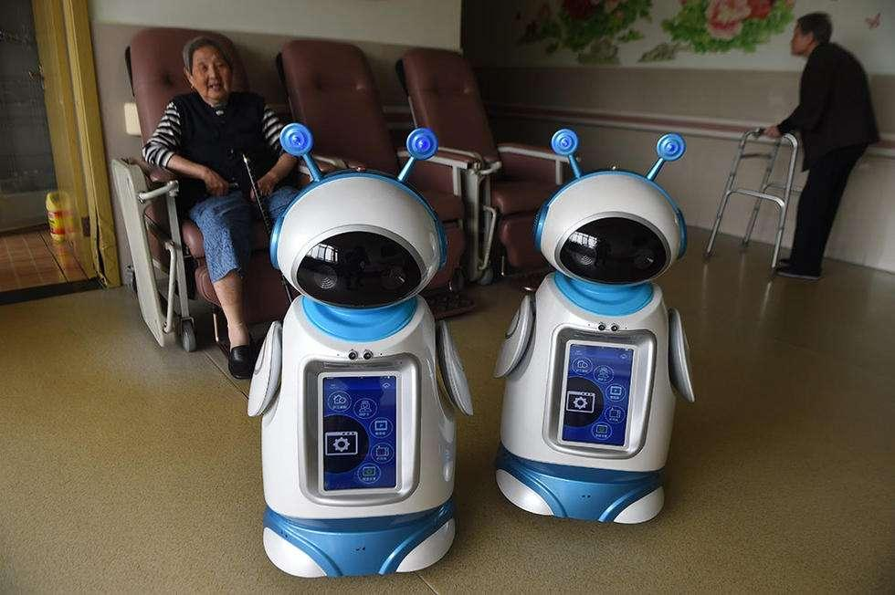

# 人工智能助力智慧养老

----------

## 摘要

人工智能技术至少可在以下几方面助力居家养老：一是以大数据推进“智慧健康”，比如可以把老人的血压等数据传到“云”上，同时将其以往病历放到“云”上，医生可通过网络为老人们提供健康建议；二是生产“智能看护”等服务机器人，可辅助老人做一些简单家务，观察老人有无异常情况，并配有提醒功能；三是生产更多更先进的可穿戴设备，比如可以实现实时监控的血糖仪、电子化神经元、能帮助瘫痪老人驾驶轮椅的设备等等；四是在设计智慧家居时更多考虑到老人的困难和需求，以更细致的创意改善老人的生活质量。

## 分析

随着人类寿命延长，人口出生率降低，老龄化已成为世界性难题。老年人作为社会弱势群体，由于自身自主能力相对较弱、拥有的权力资源相对匮乏，以及社会地位相对边缘化，导致生存风险相对较高，需要特别关注。联合国强调，增强老年人在发展各个方面的权能，包括促进他们积极参与社会、经济和政治生活，是确保包容性和减少不平等的一种方式。

中国是世界上人口老龄化程度较高的国家之一，老年人口数量最多，老龄化速度最快。世界银行2018年公布的一份报告预计，到2027年，我国65周岁及以上人口的比例将从2002年的7%上升到14%，进入深度老龄化社会。迅速的老龄化以及人口和社会或结构变化本身就可能加剧老年不平等，从而限制经济增长，削弱社会凝聚力，成为未来可持续发展的最重大挑战。正如习近平主席强调：“满足数量庞大的老年群众多方面需求、妥善解决人口老龄化带来的社会问题，事关国家发展全局，事关百姓福祉，需要我们下大气力来应对。” 

AI养老通过改变信息交流传递方式、强化资源配置整合力度、提升服务管理效率等手段为老龄化问题提供了新的解题思路，推动了健康养老服务质量和效率水平的提升,成为行业新的发展方向和必然趋势，也为老龄群体提供了一种更加人性化、高效的养老方式，满足不同老人的个性化需求，让晚年生活更加健康、幸福、温暖、有尊严。

## 图片

## 标签
智慧养老、老龄化问题、减少不平等（SDG10）

----------

 
 
 
 
