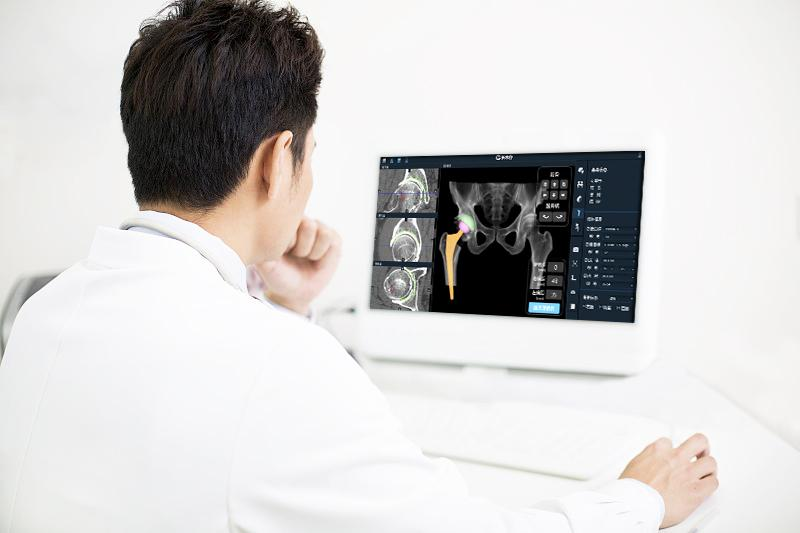

# Changmugu AI orthopedic intelligent team expansion

----------

## Abstract

In the process of expanding A I orthopedic intelligence, Beijing long wood valley medical technology co., LTD. (hereinafter referred to as the "long wood valley") has signed dozens of leading level of orthopedic center in China, in order to expand long wood valley AI orthopedic intelligent research project team, create, share new technology, promote innovative technology landing, recently, long wood valley and six large joint, including Peking University people's hospital center signing cooperation, leading intelligent orthopedic change, power AI orthopedic intelligence.

It is understood that a new "medical black technology" —— artificial intelligence auxiliary preoperative design A I K N E E system was recently introduced in A I orthopaedic intelligent research project one of the cooperation orthopedic center, the system adopts the world's first three-dimensional segmentation and anatomical identification neural network artificial intelligence algorithm, can provide comparable to "beidou" navigation accurate surgical planning and guidance.Doctors only need to input the patient's CT scan data into the system, and the system can automatically perform 3 D reconstruction and accurate segmentation.Not only can generate the three-dimensional image of the knee joint, but also can automatically match the appropriate joint prosthesis model, planning the best position and Angle, eventually generate interactive planning report and simulated operation results, let the doctor to the location of the operation, Angle at a glance, greatly improve the clinical efficiency, solve the customer surgery full knee replacement surgery problems.
 

## Analysis

The problem of difficult and expensive medical treatment is very prominent in China, mainly manifested in two aspects. One is the uneven distribution of medical resources.According to statistics, tertiary hospitals have nearly 90% of high-tech equipment and excellent medical personnel in the current medical service system. Serious insufficient medical equipment, low doctor density limit limited treatment ability and often need to be referred to large hospitals for subsequent diagnosis and treatment or conservative treatment; Second, primary hospitals are crowded, but tertiary hospitals and clinics are overcrowded every day, and the low proportion makes doctors under high pressure and disputes.In addition, combined with the sudden COVID-19 outbreak, the peak pressure of the "wartime" medical system cannot be met by relying on the traditional medical mode.

In the face of the above situation, through the supply-side reform, in addition to increasing the supply of medical resources, the use of A I technology to improve the use efficiency of medical resources is one of the effective ways to quickly alleviate the current shortage of medical resources:

First, through the AI algorithm to assist doctor diagnosis and treatment, can greatly reduce the burden on doctors, release the energy and time to handle more urgent events, diagnose and treat more patients, do more focused communication with patients, while reducing the pressure of the medical system is conducive to the benign development of doctor-patient relationship.

Second, the A I algorithm implements the expert experience and knowledge map digital, standardization, can copy and output, increase the overall supply of medical resources, quickly improve the medical level of grassroots hospitals, make patients in developed or remote areas, can be nearby, enjoy the basic homogeneous medical services, promote the balanced development of medical and health resources.

The application and promotion of artificial intelligence in the medical field is the concrete embodiment of SenseTime's A I ethical principles, and is also in line with the UN advocated Sustainable Development Goals (S D G 10 and S D G 3) —— to reduce the regional gap and human inequality caused by insufficient resources and uneven distribution, to ensure that everyone has the power to pursue a healthy and happy life.

## Pictures

Figure: The "AI HIP system" independently developed by Changmu Valley

----------
 
 
