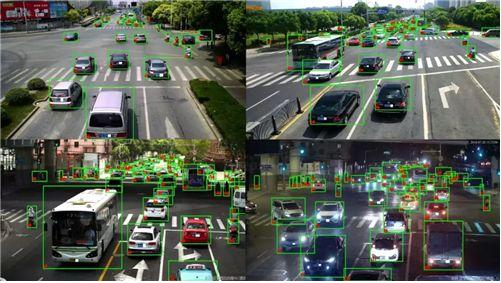

# 深圳交通、气象借助人工智能实现智慧化升级

----------

## 摘要

深圳市公安局交通警察局局长徐炜介绍，深圳交警正在将人工智能和5G技术全面运用到交通执法、治堵、指挥等方面。深圳交警和华为云合作，基于AI、大数据等技术推出的红绿灯配时方案，已部署到全市约200个路口。初步成果显示，在高峰期路口通行能力可提升约10%。计划未来几年内，将深圳2000多个路口接入系统，全面提升全市路口的通行能力。

“深圳经济特区建立40周年以来，交通伴随城市的发展，给我最大的体会就是深圳交通的发展离不开科技的进步，特别这几年离不开人工智能。”徐炜介绍，针对救护车、应急抢险车、消防车等车辆，借助人工智能的力量，在急救抢险的关键时刻可以规划出一条生命通道，保证一路绿灯地到达目的地。

除了深圳交通，深圳气象局通过AI技术分析云层的雷达波的反射云层的移动状况，从而提升对短临天气预报的精准度。对比从前，目前在时间和区间上都更加精准，时间上已经做到2小时以内的预报，区间有望做到1平方公里以内，精确度已经达到较高水平。

而在今年疫情期间，利用人工智能技术建模，可以预测疫情蔓延；在疫情防控上，通过人工智能、大数据追踪密切接触者，阻断疫情的传播路径；人工智能机器人实现无接触测温、配送等。

## 分析

根据联合国的统计数据，在1950年，全球只有30%的城市人口，但到2050年，全球将有超过三分之二人口，也就是约50亿人生活在城市。快速城市化过程，将会引发土地、空间、基础设施、自然资源不足等诸多问题。现在随处可见的交通拥堵、环境污染等城市“惯性病”降低了市民生活质量，而类似新冠疫情、积水内涝等“急性病”对城市应急系统所造成的繁重压力，都是城市治理所面对的棘手难题。

引入人工智能的“智慧城市”，可以有效地缓解以上“病症”。通过技术融合，驱动“城市操作系统”完成智能化升级和改造，以提高系统韧性，增强系统自适应能力，从而提升资源利用效率、优化城市管理和服务水平，最终达到提升市民生活质量，实现城市的可持续发展目标。

## 图片

## 标签

智慧交通、智慧城市、可持续的城市（SDG11）、清洁能源、可持续能源（SDG7）

----------

 
 
 
 
