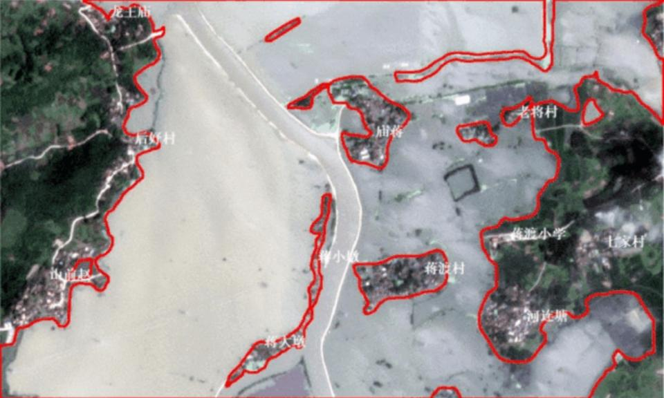
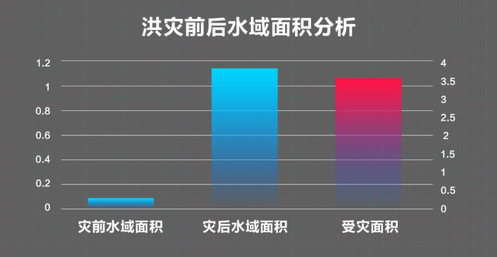

# AI破解汛情“密码” 防汛抗洪守护家园

----------

## 摘要

7月20日，因淮河干流王家坝段超出保证水位，“淮河第一闸”王家坝开闸泄洪，沃野千里的安徽阜南濛洼蓄洪区瞬间变成一片泽国；7月27日，基于气象预报信息，以及水文部门对流域上涨情况进行的预测，安徽合肥蒋口河联圩启动分洪，为巢湖“减负”1亿立方米，万人安全转移。AI遥感影像解译，便在其中发挥了积极的作用。商汤SenseRemote遥感影像智能解译解决方案，快速实现对水体、建筑、道路、绿地、农田等地物要素的自动提取，并结合GIS，分析其位置、面积及变化情况，从而判断洪灾趋势、评估灾害影响。
## 分析

正如习近平主席所说，同自然灾害抗争是人类生存发展的永恒课题。以目前的科技水平，我们尚无办法阻止自然灾害发生，但通过一定的科技手段，建立正确、系统的防灾减灾机制，增强系统应急能力，可有效降低灾难发生对人类社会造成的直接和间接损失，为人类生存挣得先机，也为人类居住安全提供保障。

从宏观角度来说，防灾减灾也是社会治理重要的组成部分。以上案例我们看到，如今的防汛抗洪工作，得到诸多数字化和智能化技术的加持，使得人们在预警、决策和调度执行方面，比以往更加科学，也更加准确，大大提升了基层防汛的工作效率，改变过去依靠人海战术的被动防汛模式，向数字化智能应急治理模式转变。

## 比较案例

> 加勒比海地区减灾计划

在过去二十年，加勒比海地区经历了龙卷风和热带风暴的剧烈袭击，造成该地区大量的人员伤亡和经济损失。基于对灾害严重性的认识，由美国海外灾害援助办公室和国际发展署与加勒比地区房屋和城市开发办公室正是提出了加勒比地区减灾计划。由海外灾害援助办公室提供资金，对所选定的西加勒比国家提供减灾技术援助。

加勒比减灾计划的目的是建立一个持久的政府和私人部门的机制，以在计划实施地区减少伤亡，减轻造成物质和经济破坏的潜在危险，缩短灾害破坏的恢复时间。该计划主要关注三大问题，一是通过现有的和计划的发展项目，减少自然灾害的易损性，改善可持续发展；二是通过编制精确的灾害图和环境易受破坏的地区图，改善公众意识和发展决策；三是推进财险业对减少损失和减轻破坏的政策。

## 图片

图：通过商汤智能遥感解译技术对6月27日和7月25日两期洪灾发生前后，巢湖市柘皋镇水域范围变化量化分析显示：洪灾发生前，柘皋镇南部某区域水域面积为0.255平方公里。受洪灾影响，该地区水域覆盖达到3.71平方公里，超过3.46平方公里被洪水淹没。

## 标签

抵御灾害、可持续发展的城市和人类住区（SDG11）

----------

 
 
 
 
