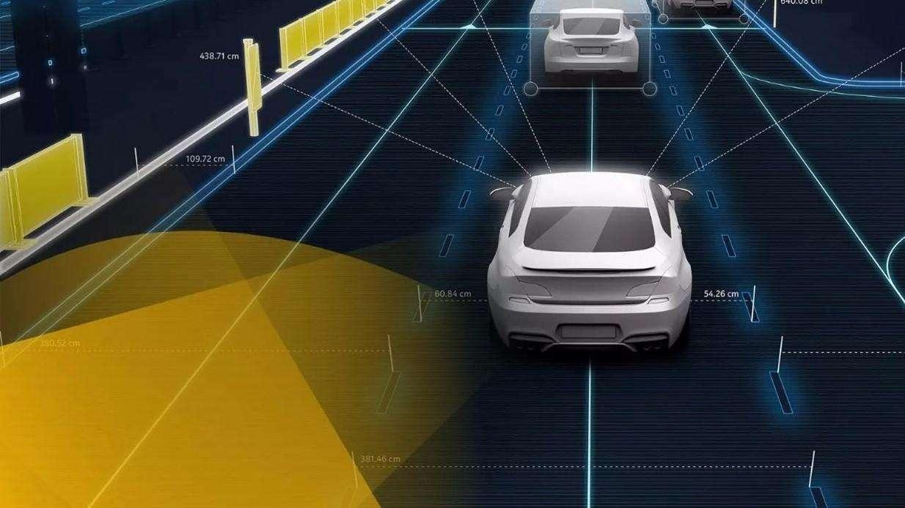

# AI“上路”，道阻且长！AI智能交通深入变革出行方式

----------

## 摘要

随着社会的发展，城镇化水平的进步，城市交通问题愈发凸显，而“如何使交通技术能够登上一个新台阶”也一直成为国内外的热点，智能交通上的研究趋于明显。

目前国内外应用较为广泛的是车牌识别系统，其数字化处理技术涉及到了头像，转化为数字信号、计算机处理等多个过程，都有关于AI技术的体现。比如在处理头像信号的时候，使用的自然语言处理，将采集到的车牌信息转化为相关的数字信号传递给计算机。人工智能技术是无人驾驶技术的基础，而无人驾驶技术也是智能交通的基本保障；作为两者联系的核心，无人驾驶技术的发展状况取决于人工智能技术的开发和应用程度，也同样影响着智能交通的建设情况。

## 分析

交通,是连接人,货物和服务的重要手段,是一个城市或社区在日常运营中不可或缺的重要元素,我们每天都在乘坐各种交通工具如小汽车,公交车,地铁等穿梭于城市中的不同地点。交通系统的平顺运行直接影响着城市的经济活动和生产效率,也影响着人们的生活质量和居住品质。然而，随着城市规模的不断扩大，人口进一步聚集，对城市基础设施承载，尤其是道路交通方面带来了愈来愈重的负担和压力。预计未来十年将有68%的人口生活在城市，单体城市规模将突破5000-8000万人，有限的道路资源和日益增长的出行需求之间的矛盾加剧，将阻碍城市可持续发展。

习近平主席说：“通过大数据、云计算、人工智能等手段推进城市治理现代化，大城市也可以变得更‘聪明’。从信息化到智能化再到智慧化，是建设智慧城市的必由之路。”交通出行智能化为城市可持续发展提供了行之有效的解决方案，尤其是基于AI技术的无人驾驶和车路联网的发展，可大幅减少汽车闲置率，更高效地利用道路网络，结合共享出行消灭大量停车场，小型充电桩取代加油站，为城市绿化释放空间，将“城市中的公园”升级为“公园中的城市”。

## 比较案例

> 滴滴上线“无障碍专车”解决特殊人群出行问题

滴滴专车与联合国计划开发署共同发起的“联合国无障碍出行”项目“无障碍专车”于2017年在北京上线，旨在解决残障人士、老年人等特殊群体出行问题。

据介绍，此次推出的无障碍专车由商务车改装，但较普通车更加宽敞。座椅可升降，从后排旋转伸出，座椅向外侧旋转后，下降至较低位置，行动不便者可较为轻松得转移到车内，适合残障人士、老人、病人、孕妇等人群使用。

“无障碍专车”意在给特殊人士提供更便捷的服务，滴滴专车与联合国合作，为“无障碍专车”司机进行量身打造了培训计划，包括如何使用车辆功能、了解特殊人群心理状态等。

滴滴用户可通过滴滴APP，选择“专车”服务，进入“预约”入口，选择“六人商务”再点击“更多服务”，勾选“无障碍车”之后等待司机接单。

 “无障碍专车”服务正是积极响应了联合国可持续发展目标SDG11的呼吁，为残障人士提供安全、便捷的出行服务，满足残障人士的交通需求。

## 图片

## 来源

<a href="https://www.toutiao.com/a6701112656209641996/" target="_blank">点击打开</a>

## 标签
智慧交通、可持续的交通体系（SDG11）

