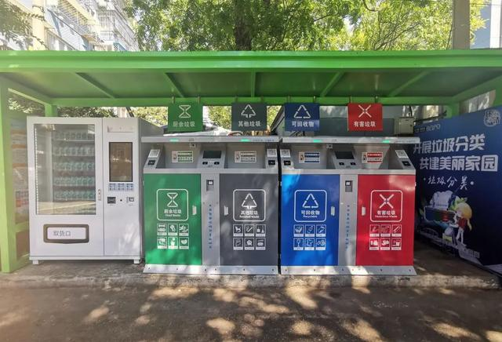

# 景观式超炫酷智能垃圾站告别“脏乱差”

----------

## 摘要

智能垃圾分类收集站采用人脸识别系统，之前小区居民已经下载了进行了人像信息采集，被录入人像采集系统的居民，只要走到垃圾柜的摄像头前，投放口就会自动开启，投放正确后，积分就会“即时到账”，如果投放错误，智能机除了会“滴滴”作响外，积分会被扣除。在垃圾箱的最左侧还有码放整齐的环保袋，积分累计30分后，便可兑换可降解环保垃圾袋。

同时，智能垃圾分类收集站设有自动称重功能，垃圾重量会自动上传后台服务系统，当垃圾积存到一定数量，智能垃圾分类收集站会及时派工作人员清理箱内垃圾。

## 分析

垃圾围城成为全球趋势，垃圾是城市发展的附属物，每年城市和人的运转所产生上亿吨的垃圾，成为城市垃圾处理中的棘手问题。高速发展中的中国城市，正在遭遇“垃圾围城”之痛。

垃圾分类被公认为缓解“垃圾围城”问题的必要手段之一，坚持做好垃圾分类，不仅对人居自然环境的有效保护，还能避免资源浪费，同时减少环境污染的重要措施。

尽管社区一直都在鼓励市民对生活垃圾进行分类投放，还且还出台了一些相应的激励措施，宣传工作也做到了每家每户，城市居民素质也相对较高，理应实行分类垃圾的推行会比较容易，但事实上，这项工作的推进还非常缓慢，更不提在农村地区推广效果。分析主要原因还是在于居民缺乏垃圾分类意识和分类知识，以及目前垃圾分类监管主要依靠的是社区人力监督，监管成本较高，难以做到全时段全方位管理，垃圾分类“强制性”不明显。

利用人工智能等技术手段帮助居民精准投放垃圾，并配合实物激励体系，通过“以奖促治”代替人为监督，大大降低了人工监督成本，进一步提升垃圾投放效率，帮助居民养成垃圾分类习惯。

## 比较案例

> 打赢“蓝天保卫战” 杭州在行动

据联合国官方网站报道，中国杭州在抗击空气污染方面取得的成绩有目共睹。据杭州市政府提供的数据，在2013年到2018年期间，杭州市区大气中的细颗粒物（PM2.5）平均浓度下降43%，霾天数从2013年的185天，削减到2018年的40天。这一成果的背后是一场旨在推动清洁、低碳、生态、环保的“绿色行动”。

中国曾经被认为是“自行车王国”，但在过去的40年里，中国的经济繁荣和城市化使得许多人转而使用机动车作为主要交通工具，这导致了空气质量恶化。为了改善公众健康和大气环境，2008年，杭州成为中国首个启动共享单车的城市。过去十年，当地政府一直在改善自行车骑行的基础设施，比如专门设立自行车车道和交通信号灯，并提供了近8.6万辆公共自行车。智能公交卡能够让用户方便地使用从自行车到公共汽车的各种公共交通工具。

由于这些举措，自行车已成为当地居民和游客的热门出行选择，杭州公共自行车交通服务系统由于其对绿色能源的杰出贡献获得了顶尖国际奖项——阿什登可持续交通项目奖。

## 图片

## 标签

环境保护、可持续的城市和人类住区（SDG11）

