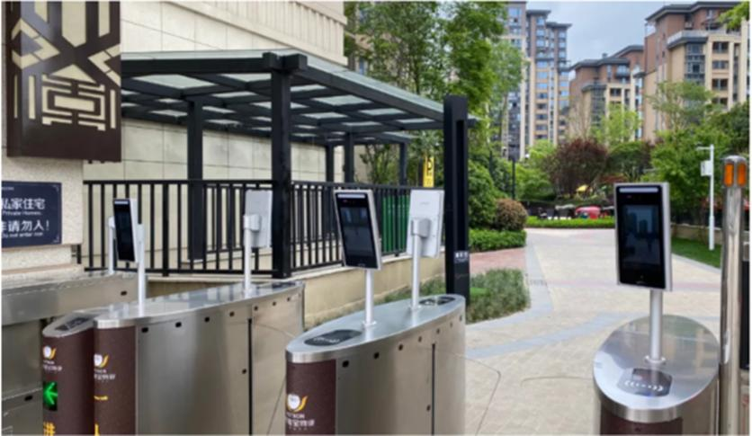

# 广东又一网红公园爆火，超级智能公园，被称为当地的“娱乐之光”

----------

## 摘要

这一座公园采用众多新型科技，并且还有互联网以及视频网等高新科技。这里的足球公园就是智能化的，其中有小型的足球场，非常小，但是足够人们玩乐，还有综合康体设备、平衡设备还有各种各样的锻炼设备。

这一个公园主要打造的是儿童娱乐，每周小孩子都要叫着自己的家长带着自己前去玩耍。这样也有非常多的好处，小孩子们出去锻炼一下身体，也就不会一直在家玩手机，对平时的社交以及视力等都有非常多的好处。其中足球场就有7种不同的小游戏，并且是现代化的智能足球场。不仅能够在这里玩游戏，还能学习到非常多的有用的知识，锻炼自己的身体精准度以及力度。

## 分析

城市公共空间的扩大标志着曾经以生产功能为主导的城市正在向以文化、休闲、康养功能为主导的宜居城市转型。这也正如亚里士多德所说的那样：“人们为了生活而来到城市，为了生活得更好而留在城市。”城市公共空间是人们日常交流活动的场所，不仅仅关系着城市形象，更是居民生活及城市发展的需要。这也就要求，在空间设计和建设阶段，需要摆脱“重修饰、轻功能”的倾向，发挥公共空间作为城市功能有机组成部分的作用。对此在本案例中，通过在空间中融入人工智能，增加空间趣味，让居民在公共空间所提供的各种服务设施中得到全身心的放松。

## 图片

## 标签

公共空间、可持续的城市和人类住区（SDG11）

----------

 
 
 
 
