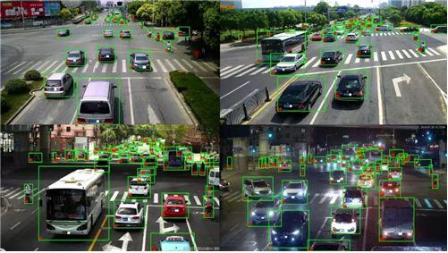

# Shenzhen transportation and meteorology use artificial intelligence to achieve intelligent upgrading

----------

## Abstract

Xu Wei, director of the traffic police department of the Shenzhen Municipal Public Security Bureau, said that the Shenzhen traffic police are fully applying artificial intelligence and 5G technology to traffic law enforcement, congestion control, command and other aspects.Shenzhen traffic police and Huawei Cloud have launched the traffic light timing scheme based on AI, big data and other technologies, which has been deployed to about 200 intersections in the city.Preliminary results show that traffic capacity at peak intersections can be increased by about 10%.It plans to access the system of more than 2,000 intersections in Shenzhen in the next few years to comprehensively improve the capacity of the city's intersections.

"Since the 40th anniversary of the establishment of Shenzhen Special Economic Zone, transportation, along with the development of the city, gives my biggest experience is that the development of Shenzhen transportation cannot be separated from the progress of science and technology, especially from artificial intelligence in recent years."Xu Wei introduced that for ambulances, emergency rescue vehicles, fire trucks and other vehicles, with the help of artificial intelligence, at the critical moment of emergency rescue to ensure the green light to the destination.

In addition to Shenzhen traffic, Shenzhen Meteorological Bureau analyzed the movement of the reflected clouds in radar waves through A I technology, thus improving the accuracy of the short-weather weather forecast.Compared with the past, the time and interval is more accurate, the time has been forecast within 2 hours, the interval is expected to reach within 1 square kilometer, and the accuracy has reached a high level.

During this year's epidemic, the modeling of AI technology can predict the spread of the epidemic; in epidemic prevention and control, the close contacts are tracked through artificial intelligence and big data to block the transmission path of the epidemic; and AI robots realize no-contact temperature measurement, distribution, etc.

## Analysis

According to United Nations statistics, only 30 percent of the urban population was available worldwide in 1950, but by 2050 there will be over two-thirds of the global population, That means about 5 billion people live in cities.Rapid urbanization process will cause many problems such as insufficient land, space, infrastructure and natural resources.Nowadays, urban "inertia diseases" such as traffic congestion and environmental pollution have reduced the quality of life of citizens everywhere, and the heavy pressure caused by urban emergency systems such as the COVID-19 and the waterlogging are all difficult problems faced by urban governance.

The introduction of "smart cities" with artificial intelligence can effectively alleviate the above "diseases".Through technology integration, the "urban operating system" is driven to complete intelligent upgrading and transformation to improve system resilience and system adaptability, so as to improve resource utilization efficiency, optimize the level of urban management and service, and finally improve the quality of life of citizens and achieve the sustainable development goal of the city.

## Pictures

----------
 
 
