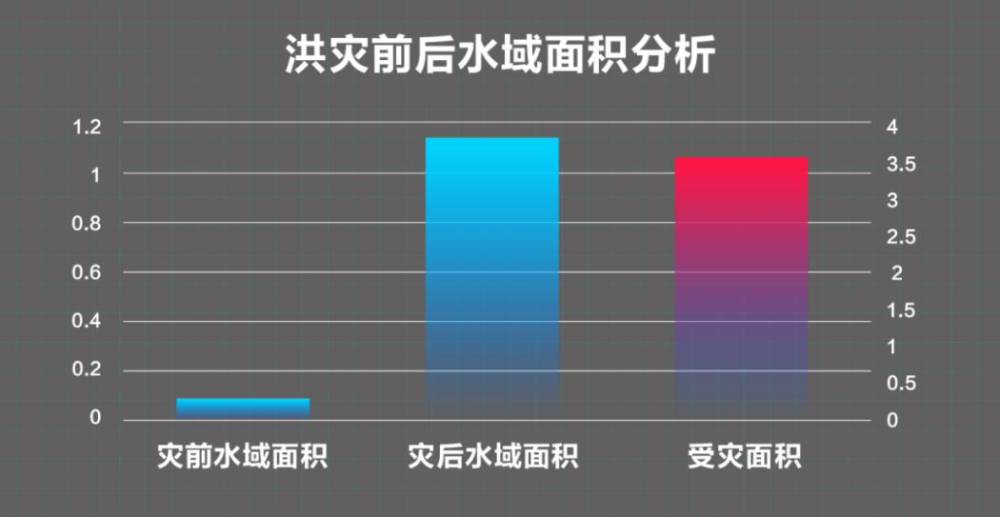

# AI crack flood situation "password" flood control flood protection home

----------

## Abstract

On July 20, because the main stream of wangjiaba section beyond the guaranteed water level, the "huaihe river" wangjiaba flood discharge, funan wa flood storage area instantly into a Zeguo; on July 27, based on the weather forecast information, and hydrological department forecast, anhui jiangkou river Lianwei started flood discharge, chaohu "burden" 1 00 million cubic meters, ten thousand people safe transfer.AI remote sensing image interpretation has played an active role in it.Sensetime S en s e R e m o t e remote sensing image intelligent interpretation solution, to quickly realize the self-integration of water body, construction, roads, green space, farmland and other land and material elements Dynamic extraction and analyze its location, area and change combined with GIS, to determine flood trend and assess disaster impact.

## Analysis

As President Xi Jinping has said, fighting against natural disasters is an eternal subject of human survival and development.With the current level of science and technology, we have no way to prevent natural disasters, but through certain scientific and technological means, establish a correct and systematic disaster prevention and mitigation mechanism, enhance the system emergency ability, can effectively reduce the disaster caused by direct and indirect losses to human society, earn opportunities for human survival, also provide security for human living security.

From a macro perspective, disaster prevention and mitigation is also an important part of social governance.The above cases we see, today's flood control and flood fighting work, get a lot of digital and intelligent technology, make people in early warning, decision-making and scheduling execution, more scientific than before, more scientific and more accurate, greatly improve the grassroots flood control efficiency, change the past relying on human tactics passive flood control mode, to the digital intelligent emergency management mode.

## Pictures

Figure: The change of Zhegao Town, Chaohu City, quantified the scope of water before and after July 25 of the flood on June 27, through SenseTime intelligent remote sensing interpretation technology. The analysis shows that before the flood, the water area in the south of Zhegao Town was 0.255 square kilometers.Affected to flooding, the water coverage in the area reached 3.71 Square kilometers, more than 3.46 square kilometers were flooded.

----------
 
 
