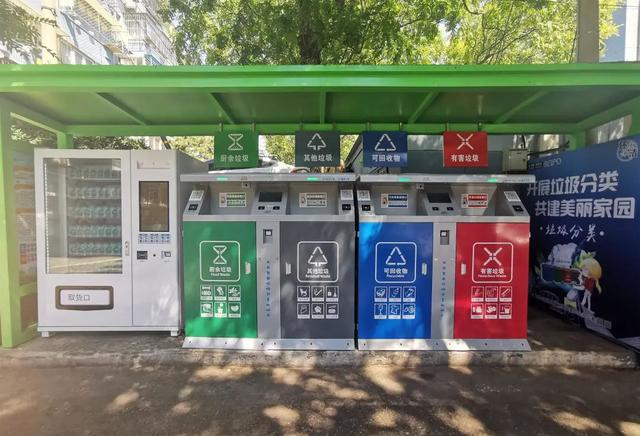
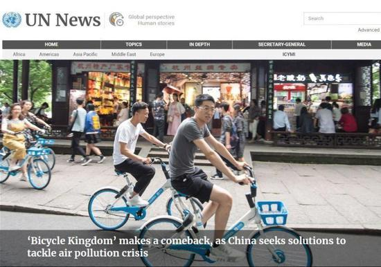

# Landscape type super cool intelligent garbage station bid farewell to "dirty and messy"!

----------

## Abstract

Intelligent garbage classification collection station using face recognition system, before community residents have downloaded the portrait information collection, was input portrait collection system, as long as go to the camera of the garbage cabinet, port will automatically open, after correct, points will "instant account", if put error, smart machine in addition to "drops", points will be deducted.On the far left of the bin, there is a neatly placed environmental protection bag, with 30 points, can be exchanged for biodegradable garbage bag.

At the same time, the intelligent garbage classification and collection station is equipped with an automatic weighing function, and the garbage weight will be automatically uploaded to the background service system. When the garbage accumulates to a certain amount, the intelligent garbage classification and collection station will send staff to clean up the garbage in the box in time.

## Analysis

Garbage siege has become a global trend, and garbage is an appendage of urban development. The annual operation of cities and people produces hundreds of millions of tons of garbage, which has become a thorny problem in urban garbage disposal.Rapid developing Chinese cities are suffering from the pain of "garbage siege".

Garbage classification is recognized as one of the necessary means to alleviate the problem of "garbage siege". Adhering to doing a good job in garbage classification is not only an effective protection of the living and natural environment, but also an important measures to avoid waste of resources and reduce environmental pollution.

Although the community has been encouraging citizens to classify household garbage, and also introduced some corresponding incentives, propaganda work also did every household, urban residents quality is relatively high, should implement garbage will be easy, but in fact, the work is very slow, not to mention promotion effect in rural areas.The main reason for the analysis is that residents lack of garbage classification awareness and classification knowledge, and the current garbage classification supervision mainly relies on community human supervision. The supervision cost is high, so it is difficult to achieve comprehensive management during the whole time, and the "mandatory" of garbage classification is not obvious.

Using artificial intelligence and other technical means to help residents accurately release garbage, and cooperate with the physical incentive system, through the "award to promote governance" instead of human supervision, greatly reduce the cost of manual supervision, further improve the efficiency of garbage delivery, and help residents develop the habit of garbage classification.

## Pictures

----------
 
 
