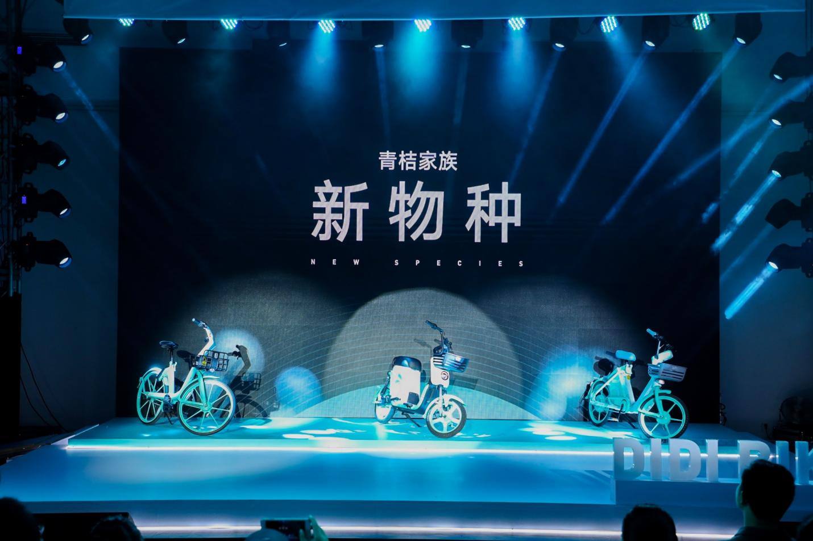

# The "Green Orange Intelligent Control Center" realizes the intelligent scheduling and operation of shared bikes

----------

## Abstract

On August 13, Didi's bike-sharing brand Qingju launched three new cars in Beijing, including changing the Angle, doubling the vehicle scheduling and maintenance efficiency, and Qingfan electric scooter and gazelle speed car.The green orange intelligent power changing cabinet, which solves the pain points of tram endurance, also made its debut at the media Open Day.

For the first time, Green Orange demonstrated its "Green Orange Intelligent Control Center" used for urban vehicle management.Relying on Didi's massive travel data and A I computing platform, the system has built the prediction ability of Qingju's short-distance travel needs in the city. Through Beidou +GPS dual-mode high-precision navigation and positioning, "fixed-point vehicle return and entry settlement" is realized, combined with the big data management platform of Qingju, intelligent scheduling operation and vehicle allocation are optimized.

## Analysis

With the popularity of shared bikes, citizens' daily travel is more convenient.However, the disorderly management of bike-sharing has also brought some problems to urban governance, especially the problem of green occupation and road occupation. It not only wastes urban space and affects the appearance of the city, but also causes a burden for pedestrians, especially the disabled groups.

Green orange through A I computing platform and high-precision positioning navigation technology to realize vehicle intelligent scheduling, not only improve the Shared bike operation efficiency, meet the needs of users riding, also strengthen the management efficiency of sharing bikes, bring travel convenience for urban residents at the same time, also for pedestrians, disabled people create barrier-free travel space.

## Pictures

----------
 
 
