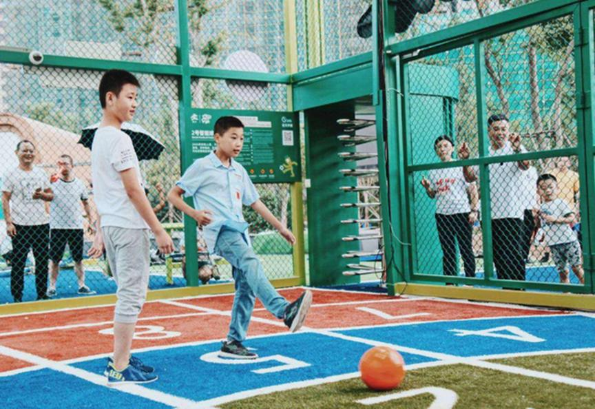

# Guangdong another network red park fire, super intelligent park, known as the local "entertainment light"

----------

## Abstract

This park uses many new technologies, as well as high-tech such as Internet and video network. The football park here is intelligent. There are small football fields, which are very small but enough for people to play. There are also comprehensive recreation equipment, balance equipment and various exercise equipment.

This park is mainly for children's entertainment. Every week, children ask their parents to take themselves to play. This also has a lot of benefits. When children go out to exercise, they won't play mobile phones at home all the time, which is very good for their usual social interaction and eyesight. Among them, there are 7 different games in football field, and it is a modern intelligent football field. Not only can you play games here, but you can also learn a lot of useful knowledge and exercise your physical accuracy and strength.

## Analysis

The expansion of urban public space indicates that the city once dominated by production function is transforming into a livable city dominated by culture, leisure and health care functions. This is just as Aristotle said: "People come to cities to live and stay in cities to live better." Urban public space is a place for people's daily communication activities, which is not only related to the image of the city, but also the needs of residents' life and urban development. This requires that in the stage of space design and construction, it is necessary to get rid of the tendency of "emphasizing decoration and neglecting function" and give full play to the role of public space as an organic part of urban function. In this case, by integrating artificial intelligence into the space, the interest of the space can be increased, so that residents can relax wholeheartedly in various service facilities provided by the public space.

## Pictures

----------
 
 
