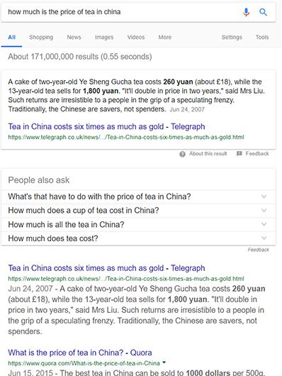

# 谷歌搜索功能

----------

## 摘要

Google搜索引擎通过研究搜索中使用的语言学而随着时间的流逝而发展。它的AI从结果中学习，并随着时间的推移进行调整，以更好地满足用户的需求。

例如，搜索“中国茶的价格是多少”可以让Google在顶部突出显示“最佳答案”的选择，然后列出可以回答该问题的消息来源。Google算法的目的是向搜索者提供最佳结果。 为了做到这一点，Google使用AI尝试确定内容的质量并将其与用户的查询相匹配。

## 分析

人类在从事生产和消费的过程中很大部分时间都在处理信息问题，包括信息的搜寻和处理。互联网在过去的十年大幅降低了人们在信息搜寻过程中的时间成本，任何人在任何地方和任何时间都能够通过互联网平台搜寻到相关信息。互联网的发展也同时带来了信息爆炸，面对海量的、冗余的、复杂的信息搜寻结果，如何筛选符合用户需求的“最佳答案”，高效利用信息资源，成为有效生产和消费的关键。人工智能提升了海量信息的处理效率，辅助企业和消费者快速做出更好的决策，与此同时，如果将环保、节能等循环经济概念融入信息决策标准，可进一步推动可持续生产和消费水平的不断提高。

## 图片

## 标签

可持续的生产和消费(SDG12)

----------

 
 
 
 
