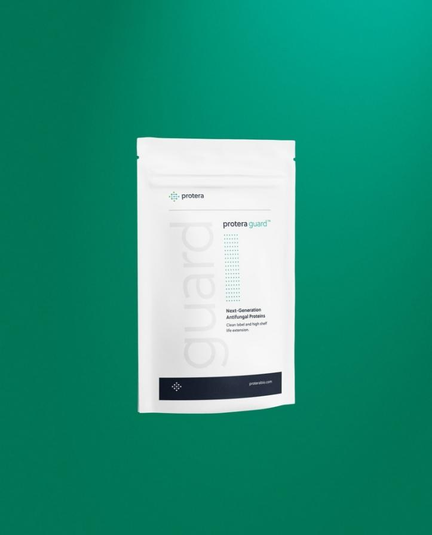

# Protera利用AI打造可持续蛋白质产品

----------

## 摘要

据外媒 FinSMEs报道，近日，总部位于智利圣地亚哥「Protera」获得了 560 万美元 A 轮融资，此轮融资由 Sofinnova Partners 领投，SOSV 参投。此外，Sofinnova Partners 的合伙人 Joko Bobanovi 将加入「Protera」的董事会。2015 年，「Protera」由首席执行官 Leonardolvarez 和首席运营官 Francia Navarrete 共同创立。它是一家人工智能驱动的初创公司，旨在设计和开发安全、可持续、价格合理的蛋白质食品原料，以提供一系列的解决方案，应对当今世界在环境和消费者健康方面，所面对的各种挑战。

据了解，全世界每年所生产的食物中，有三分之一都被浪费了。然而当前，人口数量不断增长，人们对于营养食品的需求也在不断提高。此外，目前工业规模的食品生产技术，对环境产生了长期的负面影响。因此，「Protera」开发了一个独特的生产过程，叫做 Natural Intelligence，生产经济环保的配料，在不影响食品质量的情况下，使食品和配料制造商，生产有利于环境可持续发展的产品。Natural Intelligence 使用了其专有的深度学习算法 MADI，可以快速预测并识别自然界中存在的，且价值高的蛋白质产品和酶。通过使用 MADI，「Protera」可以比以往更快地发现和制造新的蛋白质成分。

## 分析

食品生产对环境带来的污染不可小觑。食品生产过程是由诸多前后有联系的环节组成的。在这个过程中，需要消耗许多的食品原材料，比如淀粉、糖、水和化合物。同时会产生大量的有害物质，污染环境。食品生产对环境的污染主要包括化学物质污染、生物污染、水污染和大气污染。根据对某食品加工厂的分析调查，可以发现，食品生产中产生了众多的污染物质，比如悬浮性固体、硝酸盐、甲基吲哚等，这些物质都会对环境造成一定的污染。

在食品生产过程中，必需在保证食品质量安全的基础上，最大限度地降低对环境的污染，也就是要做到安全生产和绿色生产，这是对食品生产过程的两个最基本的要求。本案例中，通过与人工智能和机器学习技术结合，选择自然界配料代替人工合成，可以有效降低化学合成配料过程中对环境造成的污染负担，有助食品工业的可持续发展。

## 图片

## 标签
环境保护、可持续生产（SDG12）

----------

 
 
 
 
