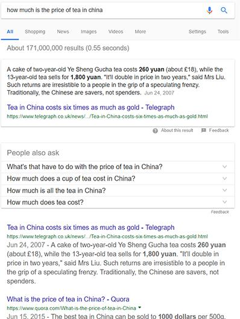
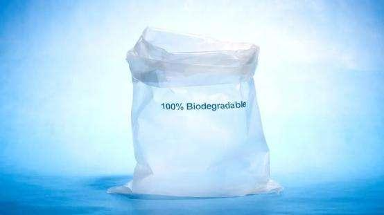

# Google search feature

----------

## Abstract

The Google search engine has evolved over time by studying the linguistics used in search. Its AI learns from the results and adapts over time to better meet the user's needs.

For example, a search for "What is the price of Chinese tea" could have Google highlight a "best answer" selection at the top, followed by a list of sources that could answer the question. The purpose of the Google algorithm is to provide the best results to the searcher. To do this, Google uses AI to try to determine the quality of the content and match it to the user's query.

## Analysis

In the process of production and consumption, human beings spend most of their time dealing with information problems, including information search and processing. In the past decade, the Internet has greatly reduced the time cost of people in the process of information search, and anyone can search relevant information through the Internet platform at any place and at any time.The development of the Internet has also brought about an information explosion, in the face of massive, redundant and complex information search results, how to screen the "best answer" that meets the needs of users and make efficient use of information resources has become the key to effective production and consumption. Artificial intelligence improves the processing efficiency of massive information and assists enterprises and consumers to make better decisions quickly.At the same time, if the concept of circular economy such as environmental protection and energy saving is integrated into the information decision-making criteria, it can further promote the continuous improvement of sustainable production and consumption level.

## Pictures

----------
 
 
