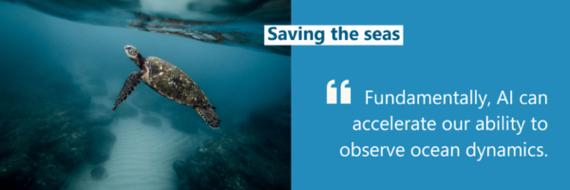

# 人工智能保护海洋生态

----------

## 摘要

IMT Atlantique研究团队是“人工智能地球-欧盟海洋奖”的获奖者之一，该奖项是欧洲研究组织针对相关保护海洋项目的资助奖。将资助研究者提供人工智能工具和云计算资源，以帮助他们开展工作。这些都是微软人工智能地球计划的一部分，自两年前成立以来，该计划已经为236个项目提供了资助。RonanFablet教授和他法国IMT Atlantique的研究团队一直在研究和预测气候的变化对海洋的影响，并利用卫星遥感数据对海洋大气动力学进行建模、分析和重建，使其可以更好的了解气候对地球的潜在影响，以及气候的变化对海洋的影响。RonanFablet教授表示：“数据可以帮助我们了解海洋的健康状况，包括温度和海平面上升等级。但我们依旧需要技术支持去获得大量的数据并将其转化为智能化操控。从根本上讲，AI可以加快我们研究海洋动力学的能力。”

IMT Atlantique团队通过Azure上提供的各项能力来构建海洋表面的3D模型，并借助这一模型来测试和验证一些新的想法，从而加深对海洋表面变化的理解。通过这一项目获取的信息和理论，能够帮助海洋学家和自然资源保护者更好的保护我们海洋。

## 分析

世界上的海洋，其温度、化学成分、洋流和生物，驱动着全人类居住的地球系统。我们的雨水、饮用水、天气、气候、海岸线，我们的许多食物，甚至我们呼吸的空气中的氧气，最终都是由海洋提供和调控的。

气候危机正在从根本上改变海洋的生态环境，并进一步影响全球气候状况：珊瑚礁等生态系统的生存将受到威胁，海洋热浪、飓风等现象将变得更加频繁和严重，海平面上升和极端气候问题将迫使数百万人流离失所。联合国政府间气候变化专门委员会（IPCC）在发布的《气候变化中的海洋和冰冻圈特别报告》中，对气候变化给全球海洋造成的影响和状况发出严厉警告，保护全球海洋的紧迫性被提上日程。

通过卫星遥感获取全球气候数据，并利用AI技术对海量数据进行高效处理和分析，帮助研究人员加深气候变化对海洋生态影响的认知和理解，有助人们采取更加行之有效的方式来保护海洋生态。

## 比较案例

> 无境深蓝：关爱海洋生物,保卫蓝色星球

自2017年创立，由中国热爱海洋公益事业的潜水员发起的无境深蓝持续致力于通过赋能潜水员社群，建立潜水员海洋保护网络，让更多潜水员成为海洋保护的行动者，参与海洋公民科学，海洋公众教育，濒危物种及栖息地保护等项目，激发更多人学会科学友善地与海洋互动。

无境深蓝于2019年发起洁净水下家园项目，以ProjectAWARE所开发的公民科学项目DiveAgainstDebris(打击海洋垃圾)为基础，旨在通过认领一个潜点计划、打击海洋垃圾数据挑战赛、打击海洋垃圾专长课程班等活动，让更多潜水员参与水下垃圾的清理与监测，通过对水下垃圾科学和系统化的分类和报告，来获得有价值的数据，助推海洋保护政策的出台。同时通过“蓝色生活+”项目，结合多形式的多品牌联动，进行趣味性、互动性的泛科普教育和沉浸式、选择式的可持续行为引导，希望通过落地更多具有现实意义的环境友好型行为，在一定程度上推进企业绿色产业和环保技术的应用，并使其在生产生活中践行利于海洋生态环境的蓝色生活。

无境深蓝已正式成为了联合国环境署海洋垃圾全球伙伴关系的会员单位，为海洋垃圾的治理和政策倡导提供来自中国的数据和助力。

## 图片

## 标签

海洋生态保护（SDG14）

----------

 
 
 
 
