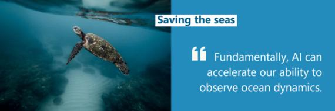

# Artificial intelligence protects marine ecology

----------

## Abstract

The IMT Atlantique research team is one of the winners of the "Artificial Intelligence Earth-EU Ocean Award", which is a funding award from the European Research Organization for projects related to the protection of the ocean. It will fund researchers to provide artificial intelligence tools and cloud computing resources to help them carry out their work. These are all part of Microsoft's AI Earth project, which has been launched since two years ago.The program has funded 236 projects. Professor Ronan Fablet and his research team at IMT Atlantique in France have been studying and predicting the impact of climate change on the ocean, and using satellite remote sensing data to model, analyze and reconstruct the dynamics of the ocean atmosphere, so as to better understand the potential impact of climate on the earth. And the impact of climate change on the oceans.Professor Ronan Fablet said: The data can help us understand the health of the oceans, including temperature and the level of sea level rise. But we still need technical support to get a lot of data and turn it into intelligent control. "Fundamentally, AI can accelerate our ability to study ocean dynamics."

The IMT Atlantique team uses the capabilities provided on Azure to build a 3D model of the ocean surface, and uses this model to test and validate new ideas to deepen the understanding of ocean surface changes. The information and theories gained through this project can help oceanographers and conservationists better protect our oceans.

## Analysis

The world's oceans, with their temperature, chemistry, currents, and biology, drive the Earth system in which all of humanity lives. Our rain, drinking water, weather, climate, coastlines, much of our food, and even the oxygen in the air we breathe are ultimately provided and regulated by the ocean.
 
The climate crisis is fundamentally changing the ecological environment of the oceans and further affecting the global climate situation: the survival of ecosystems such as coral reefs will be threatened, phenomena such as ocean heat waves and hurricanes will become more frequent and severe, and sea level rise and extreme climate problems will force millions of people to be displaced.The United Nations Intergovernmental Panel on Climate Change (IPCC) issued a special report on the ocean and cryosphere in climate change, which issued a stern warning about the impact and status of climate change on the global ocean, and the urgency of protecting the global ocean was put on the agenda.

Obtaining global climate data through satellite remote sensing and using AI technology to process and analyze massive data efficiently will help researchers deepen their understanding of the impact of climate change on marine ecology and help people adopt more effective ways to protect marine ecology.

## Pictures

----------
 
 
