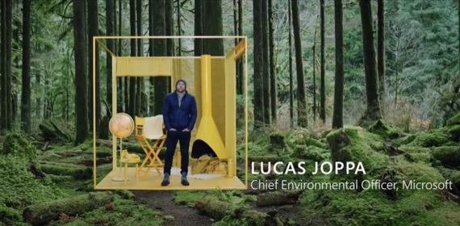
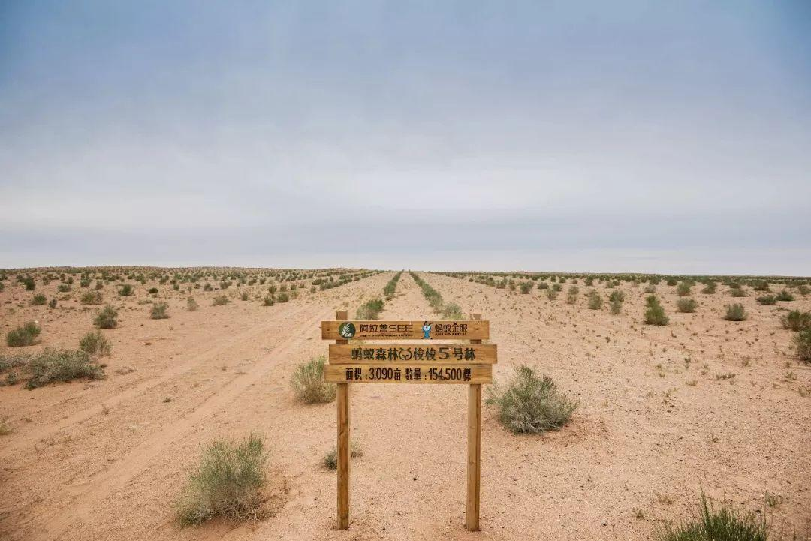

#  行星计算机：以全球数据推动可持续发展

----------

## 摘要

如果我们把地球当作一台计算机、一个拥有不断流动的数据的系统，这些数据可以被跟踪、分析，甚至有可能被预测，那么，我们能利用这台计算机来完成怎样的伟业呢？这就是微软最新推出的“行星计算机（Planetary Computer）”倡议：通过从多个来源收集汇总的全球环境数据，同时借助机器学习和其它技术，来更好地理解人类社会所面临的挑战。微软首席环境官 Lucas Joppa 在 2020 世界人工智能大会（WAIC 2020）上通过一段视频展示微软旨在促进保护和维护全球生物多样性和生态系统的举措，包括扩大“AI for Earth”计划、支持开发“行星计算机”以汇总环境数据，并将利用人工智能开发和部署推动可持续决策的技术等等。

## 分析

人类活动引起的土地利用/覆盖变化、气候变化、大气CO2浓度增高和氮沉降加剧等使得生物有机体的性状、种间关系、分布格局与生物多样性发生改变,进而影响生态系统过程和功能,并最终影响人类的生存和社会经济的可持续发展。可见，影响地球生态因素错综复杂、彼此关联。

通过对全球环境进行实时监测，收集、汇总多维数据，利用人工智能技术对海量多模态数据进行分析和处理，有助建立生态与环境变化间关系，以预测环境变化对生物多样性和生态系统的影响，从而可为自然生物多样性的保护提供支持，为地球生态健康发展寻找解决方案。这正符合联合国所倡导的第14和15项目标，利用技术手段，保护、恢复和促进可持续利用海洋和陆地生态系统，从而为人类的生存提供保障。

## 图片

## 标签

环境保护、生物多样性、生态保护（SDG14&15）

----------

 
 
 
 
