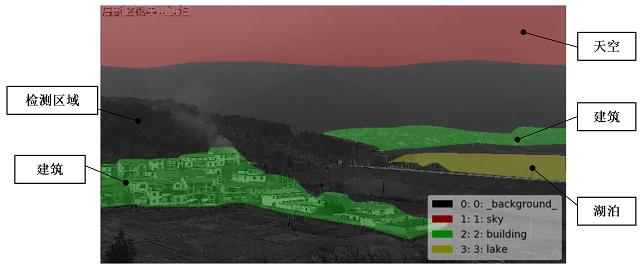

#  森林防火进入人工智能新时代

----------

## 摘要

恩博科技有限公司与华为达成战略合作伙伴关系，结合双方技术优势，针对森林防火行业的突出问题提出了具有引领意义的森防方案。该方案提出端边云全网AI，即在端侧部署软件定义摄像机、边侧部署Atlas、以及华为云鲲鹏云服务，分级部署烟火识别AI，实现端侧原始视频分析、边侧利旧设备一次分析、云侧二次分析复核。该森防方案与传统热成像方案相比，报警准确率以几何倍数提升，巡航周期缩短到3-10分钟，并能够及时发现林下火和坡下火。无论白天或夜间，该方案在巡航周期、告警及时性、识别准确率方面均大幅优于热成像方案。

森防方案打破传统“类传感器”的技术模式，利用算力、算法、林火数据结合计算机视觉与人工智能算法打造出林火识别引擎。引擎白天识别烟雾，晚上识别火光，可及早发现林下火和坡下火，适合发现林区早期火情。

此外，引擎自动判别过滤云影、雾气、水滴等干扰因子，自主“理解”复杂多变的林业监控场景，自动区分天空、山体、村庄、湖泊、道路等，有效识别大雾、阴雨等异常天气，具有野外复杂场景适应性。从屏蔽干扰维度直接提升了烟火识别准确率。

## 分析

人类的生存与发展一刻也离不开森林提供的氧气和林产品。我国虽然地大物博, 但森林资源总量仍然不足，森林覆盖率仅为世界平均水平的60%，居世界第130位；人均森林面积只有0.13公顷，不到世界平均水平的1/4，居世界第134位。

火灾是森林资源的最主要的威胁之一，它能使森林在顷刻之间化为灰烬，对森林资源和生态造成极大破坏。由于森林火灾具有“速度快、突发性强、破坏性大”的特点，过去防火救灾极为被动，每次扑火都需要动员大量消防人员，费时较长且效果欠佳，也极易造成人员伤亡。

人工智能技术的快速发展，为森林消防带来了一种全新的解决方案。利用算力、算法、林火数据结合计算机视觉与人工智能算法能够在第一时间识别火源，防森林大火于未“燃”，实现从人海战术向技术防护转变，尤其对大面积森林资源防护带来了效率上极大提升。

## 图片

## 标签

环境保护、生物多样性、生态保护（SDG15）

----------

 
 
 
 
