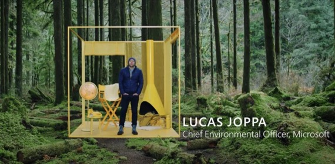

# Planetary computers: Promoting sustainable development with global data

----------

## Abstract

If we think of the earth as a computer, a system with a constant flow of data that can be tracked, analyzed, and possibly predicted, what can we do with this computer? This is Microsoft's latest Planetary Computer initiative:Through the collection of aggregated global environmental data from multiple sources, machine learning and other technologies can be used to better understand the challenges facing human society. Lucas Joppa, Microsoft's chief environmental officer, demonstrated Microsoft's initiatives to promote the protection and maintenance of global biodiversity and ecosystems through a video at the World Artificial Intelligence Conference 2020 (WAIC 2020).It includes expanding the "AI for Earth" program, supporting the development of "planetary computers" to aggregate environmental data, and using artificial intelligence to develop and deploy technologies to promote sustainable decision-making.

## Analysis

Land use/cover change, climate change, elevated atmospheric CO2 concentration and nitrogen deposition caused by human activities have changed the characteristics, interspecific relationships, distribution patterns and biodiversity of biological organisms, thus affecting ecosystem processes and functions, and ultimately affecting human survival and sustainable socio-economic development. As can be seen,The factors affecting the earth's ecology are complex and interrelated.

By monitoring the global environment in real time, collecting and summarizing multi-dimensional data, and using artificial intelligence technology to analyze and process massive multi-modal data, it is helpful to establish the relationship between ecology and environmental change, so as to predict the impact of environmental change on biodiversity and ecosystems, thus providing support for the protection of natural biodiversity.To find solutions for the healthy development of the earth's ecology. This is in line with the 14th and 15th goals advocated by the United Nations, using technological means to protect, restore and promote the sustainable use of marine and terrestrial ecosystems, so as to provide security for human survival.

## Pictures

Figure: Cooperation project between Alxa SEE and Ant Forest

----------
 
 
