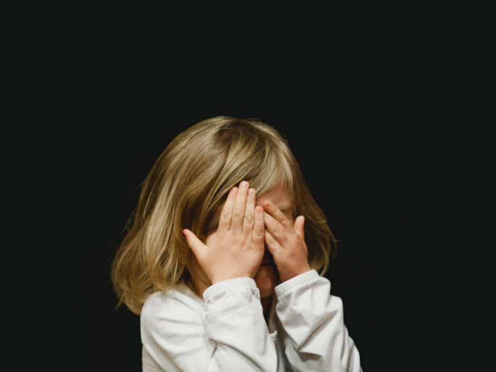

# AI工具助力儿童保护

----------

## 摘要

一种由AI驱动的软件 “Safer”，声称可以以大约99％的准确度检测出虐待儿童的图像。该软件是由非营利机构Thorn开发的，旨在帮助没有内部过滤系统的企业检测和删除此类图像。

根据英国互联网观察基金会的数据，在新冠疫情期间，有关虐待儿童的图片激增50％。从3月23日开始的11周内，其热线记录了44,809张图片，而去年同期为29,698张。这些图片的发布方大多来自儿童，他们很多是在强迫之下发布的图片。

迄今为止，Thorn最大的用户之一是图片分享网站Flickr。Flickr使用Safer，在其平台上发现了一张虐待儿童的图片，经过执法调查，解救了21名年龄在18个月至14岁之间的被虐待儿童，并逮捕了施虐者。

## 分析

近年来，儿童暴力侵害事件频发。在全球，每天都有儿童生活在身体暴力、精神暴力、性暴力、虐待、忽视和抛弃之下。据世界卫生组织估算，全世界大约有4000万15岁以下的儿童遭到虐待和忽视。儿童虐待已成为一个全球性问题。研究表明，暴力可对儿童的身体和心理健康造成影响，给他们的学习和社交能力造成永久性损害，影响儿童的健康成长以及增加暴力行为代际传递的几率。保护儿童需要受到社会各界的广泛重视。

网络上流转着大量儿童虐待的图片和视频，通过人工检索的方式很难有效、及时的阻止针对儿童的暴力行为，人工智能对处理海量图片数据具备天然优势，可以帮助网络平台快速进行针对性的图片/视频检索，与政府执法机关和儿童虐待防治机构形成实时联动，将暴力扼杀在第一时间，保护儿童免受暴力侵害。

## 图片

## 标签
诉诸司法、和平和正义（SDG16）

----------

 
 
 
 
