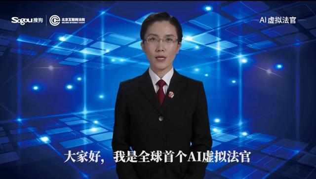

# The country's first AI virtual judge to help the application of artificial intelligence in the judicial field

----------

## Abstract

Recently, the Beijing Internet Court Online Intelligent Litigation Service Center was launched, and the first AI virtual judge in China was released. This AI judge, built with the help of voice intelligent synthesis and image intelligent synthesis technology, can guide the parties to use the network litigation platform smoothly and realize the autonomy of the whole online operation. This is a model of the application of artificial intelligence in the judicial field of our country.

At present, the application of artificial intelligence in China's court system is mainly reflected in four aspects: intelligent assistant document processing, intelligent conversion of court transcripts, intelligent assistant case trial and intelligent assistant judicial service. For example, the Beijing court system is at the forefront of the country in the construction of intelligent courts.The "Rui Judge" system, which can realize the functions of automatic document generation, voice conversion, case search and prompt, has been installed. Specifically, the writing of judgment documents can be directly input by voice, the speeches of the parties in court can be automatically converted into court transcripts, and the case search can be easily carried out when writing documents.The trial system can automatically generate the template of judgment documents, and so on, which greatly alleviates the pressure of transactional work of front-line case handlers, is conducive to the unification of judgment standards, and reduces some simple and repetitive work. In terms of intelligent assistant judicial services, AI virtual prosecution judges developed by Beijing Internet Court can provide 24-hour online services.Online mediation, court sessions and electronic service technology using the Internet reflect the intelligent level of judicial services, save judicial human resources and facilitate parties in judicial proceedings.

## Analysis

Our country is in a period of rapid growth of litigation. In 2018, 25.168 million cases were concluded and enforced by local people's courts at all levels, up 10.6% from the same period last year, while the number of post judges nationwide was more than 120000, and the number of post judges per capita exceeded 200. A large number of grass-roots judges are in a state of high load. Traditionally, in addition to holding court sessions to adjudicate cases,It also undertakes a lot of transactional work, such as litigation guidance, answering questions after judgment, law popularization, investigation and research. Therefore, as an artificial intelligence technology that can effectively reduce the routine work of judicial personnel, its application in the judicial field is very necessary.

In addition, the "7x24 hours" online judicial service provided by AI not only saves judicial human resources, but also expands the coverage of judicial services, so that more people can quickly and easily access justice, obtain legal help at a lower cost, and let everyone enjoy equal access to justice and rights. To improve the quality and effectiveness of justice,The application of artificial intelligence in the judicial field is of great value and significance in promoting judicial justice and enhancing judicial credibility.

## Pictures

----------
 
 
