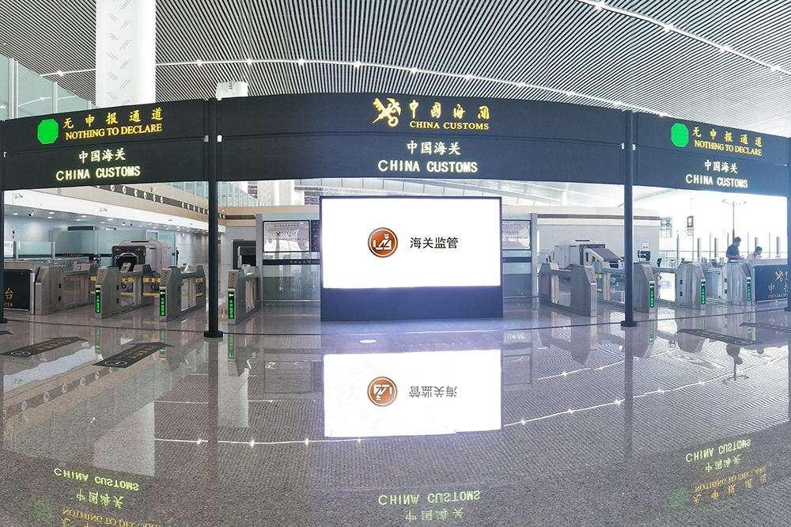

# 人工智能助力进出口货物跨境流通

----------

## 摘要

根据客户资料自动接单制单、根据员工偏好进行智能派单、机器人流程自动化……人工智能正赋能申报企业迈向智慧通关时代。海关清关报关主要以海关单证作为凭证，传统的人工制单校验模式效率低下，近年采用光学字符识别(OCR)进行单证识别是海关业务的重要场景。但是，海关单证种类繁多、每页字符多版面复杂、中英文混排，而且业务一直处于动态变化中，普通的OCR方案仅能达到80%的识别准确率，随着业务发展以及复杂度提升，方案效果也呈持续下降趋势。而智慧通关系统目前已经实现OCR光学识别、AI人工智能、RPA流程自动化、区块链共识、大数据应用、以及共享模式机制，利用每一个环节对有效数据的采集生成报关单，采用共享理念减少重复沟通。目前AI制单的正确率可达到96%，能更好地替代传统人工制单与校验模式。

## 分析

虽然中美关系对全球经济和社会合作造成了一定影响，但从长期来看，整个世界迈向全球化的趋势并没有因此而终结，加强全球伙伴合作、开放共赢仍然是未来全球经济、科技、文化发展的中心思想。

海关是国家进出关境的监督管理机关，作为全球贸易网络的重要节点，在推进区域经贸合作和贸易自由化中起到重要作用。通过采取一系列技术手段,包括本案例中提到的智慧通关系统，提高海关工作效率,实现贸易便捷化、降低通关成本和时间，有助促进区域经济往来合作，为发展中国家的中小进出口商服务，有利于加强可持续发展伙伴关系。

## 比较案例

> 中国援助巴基斯坦的“三峡”工程

巴基斯坦由于地理位置的缘故，经济发展一直不太良好，并且水资源也相当匮乏，不仅严重影响到当地的经济活动工业生产，还影响到人们最基本的生存需求，为此我国帮助巴基斯坦修建了“三峡”，即位于巴基斯坦克什米尔的尼鲁姆-杰鲁姆水电站。这项工程总耗资204亿，也是中国在建最大的境外水电站，同时也是巴基斯坦合同金额最大的基建工程项目，该水电站装机容量达到了96.3万千瓦时。

该项工程不仅能够满足当地所有的经济活动用电量，还能起到蓄水防洪的作用，有效解决当地居民用水紧张的问题， 并且为了水电站日常的维护，我国特意留下了50名工程师。

## 图片

## 标签
可持续发展全球伙伴关系（SDG17）
