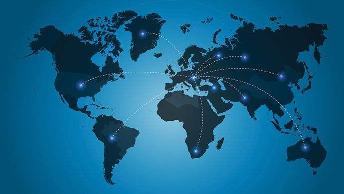

# 法加德等15国成立“人工智能全球合作伙伴组织”

----------

## 摘要

法国外交部网站6月16日报道，因国际合作对于充分利用人工智能的重要性，并为使更多的国民能够享受到人工智能的便利，加拿大、法国、德国、澳大利亚、美国、日本、韩国等15个国家正式成立全球首个“人工智能全球合作伙伴组织”。该组织将重点关注4个领域的发展，包括：合理使用“人工智能”、数据管理、对将来就业的影响、创新和商业化。专家们还将探讨“人工智能”应对和战胜新冠病毒大流行的方式和潜在贡献。该组织的秘书处将设在国际经合组织，同时在巴黎和蒙特利尔建立2个技术中心，加拿大将在2020年12月主办该组织第一届年度会议。这个组织的成立标志着加拿大成为法国数字外交的重要合作伙伴，也是两国在2018年6月提出“人工智能宣言”2年后取得的实质性进展。

## 分析

随着AlphaGo为代表的深度学习算法的成熟，人工智能技术应用进入快速发展的阶段。作为新一轮科技变革的主导力量，对未来十年人类生产、生活带来颠覆性的变化将不亚于百年前工业革命对世界的深刻影响。工业革命加速人类在技术、文化、贸易等各个领域的合作交流，在协作和博弈中构建起今天成熟的全球秩序和架构/体系，在此基础上促进了贸易自由化、技术全球化、文化多元化发展。

然而，在已然到来的新技术变革时期，我们在工业时代所搭建的旧秩序和架构在不断接受新的挑战和认知突破，譬如人工智能应用所引发的伦理问题和数字安全，以及人工智能所引导的商业变革等，都需要各国通力合作已达成新的全球共识，在此基础上才能促进新新一轮的全球经济可持续发展。

## 比较案例

推动绿色“一带一路”建设，分享绿色发展经验，将为提升沿线国家和地区的绿色发展水平发挥积极作用。“一带一路”绿色发展国际联盟是构建绿色发展国际合作伙伴的重要平台，目前已有80多家机构确定成为联盟的合作伙伴。

“一带一路”绿色发展国际联盟是我国和联合国环境署共同启动组建的，旨在推动以绿色建设贯通“一带一路”成为国际共识和共同行动，落实联合国2030年可持续发展议程。

联合国环境署执行主任埃里克·索尔海姆表示，中国在绿色发展上的成功经验可通过对话交流的形式分享给其他国家，这也是“一带一路”绿色发展国际联盟的重要意义。“一带一路”绿色发展国际联盟未来将在三个方面扮演重要角色：一是促进绿色金融发展，二是寻求制订适用于“一带一路”的基础原则和标准，三是充分发挥第三方作用，帮助沿线国家实现绿色发展。

## 图片

## 来源

<a href="https://www.weiyangx.com/367160.html" target="_blank">点击打开</a>

## 标签
可持续发展全球伙伴关系（SDG17）
