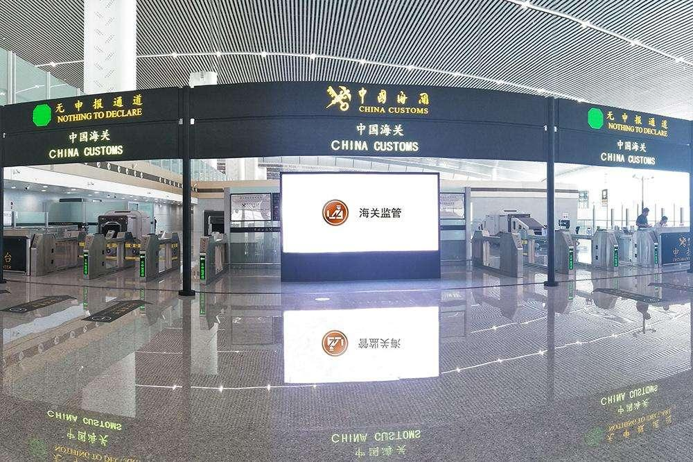
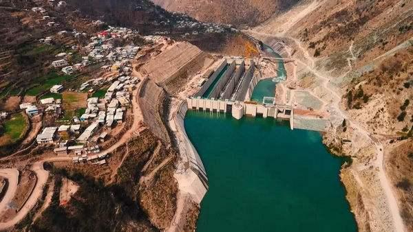

# Artificial intelligence helps cross-border circulation of import and export goods

----------

## Abstract

Automatic order making according to customer information, intelligent order dispatching according to employee preferences, robot process automation Artificial intelligence is enabling declaration enterprises to move towards the era of intelligent customs clearance. Customs clearance and declaration are mainly based on customs documents, and the traditional manual verification mode is inefficient.In recent years, the use of optical character recognition (OCR) for document recognition is an important scenario of customs business. However, there are many kinds of customs documents, many characters per page, complex layout, mixed arrangement of Chinese and English, and the business has been in dynamic change. The common OCR scheme can only achieve 80% recognition accuracy. With the development of business and the increase of complexity, the effect of the scheme also shows a continuous downward trend.At present, the intelligent customs clearance system has realized OCR optical recognition, AI artificial intelligence, RPA process automation, blockchain consensus, big data application, and sharing mode mechanism, using each link to collect effective data to generate customs declarations, and using the sharing concept to reduce repeated communication. At present, the correct rate of AI bill making can reach 96%.It can better replace the traditional manual voucher preparation and verification mode.

## Analysis

Although Sino-US relations have had a certain impact on global economic and social cooperation, in the long run, the trend of globalization of the whole world has not ended, and strengthening global partnership and cooperation, opening up and win-win is still the central idea of future global economic, technological and cultural development.
 
As an important node of the global trade network, customs plays an important role in promoting regional economic and trade cooperation and trade liberalization as the supervision and management organ of the country's entry and exit. By adopting a series of technical means, including the intelligent customs clearance system mentioned in this case, we can improve the efficiency of customs work, realize trade facilitation, and reduce customs clearance costs and time.It is conducive to promoting regional economic exchanges and cooperation, serving small and medium-sized importers and exporters in developing countries, and strengthening sustainable development partnerships.

## Pictures

----------
 
 
