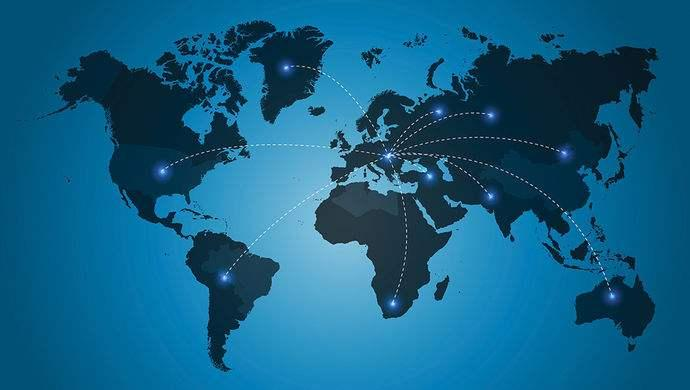

# Fagard and other 15 countries have established the "AI Global Partnership Organization"

----------

## Abstract

The website of the French Ministry of Foreign Affairs reported on June 16 that international cooperation is important to make full use of artificial intelligence and to enable more citizens to enjoy artificial intelligence. With the convenience of artificial intelligence, Canada, France, Germany, Australia, the United States, Japan, South Korea and other 15 countries officially established the world's first "artificial intelligence".

Global Partner Organization. The organization will focus on the development of four areas, including the rational use of "artificial intelligence", data management, the impact on future employment, innovation and commercialization. Experts will also discuss the ways and potential contributions of "artificial intelligence" to cope with and overcome the novel coronavirus pandemic. The Secretariat of the organization will be located at the International Organization for Economic Cooperation,At the same time, two technology centers will be established in Paris and Montreal, and Canada will host the group in December 2020.

First Annual Meeting of the Organization. The establishment of this organization marks that Canada has become an important partner of France's digital diplomacy, and is also a substantial progress made by the two countries two years after the "Declaration on Artificial Intelligence" was put forward in June 2018.

## Analysis

With the maturity of the deep learning algorithm represented by AlphaGo, the application of artificial intelligence technology has entered a stage of rapid development. As the leading force of a new round of scientific and technological change, the subversive changes in human production and life in the next decade will be no less profound than the impact of the Industrial Revolution on the world a hundred years ago.The Industrial Revolution accelerated the cooperation and exchange of human beings in technology, culture, trade and other fields, and built today's mature global order and framework/system in cooperation and game, on the basis of which it promoted the development of trade liberalization, technological globalization and cultural pluralism.

However, in the coming period of new technological change, the old order and structure we built in the industrial age are constantly facing new challenges and cognitive breakthroughs, such as ethical issues and digital security caused by the application of artificial intelligence, as well as business changes led by artificial intelligence, which require all countries to work together to reach a new global consensus.Only on this basis can we promote a new round of sustainable development of the global economy.

## Pictures

----------
 

