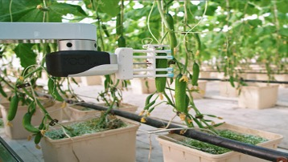

# 用机器学习加卫星,斯坦福大学从太空中就能识别贫困地区

----------

## 摘要

在很多第三世界国家，由于基础设施薄弱，缺乏收集数据和共享数据的合作能力，全套经济变量难以获得且极不可靠。然而，缺乏高质量的数据会阻碍该地区的经济发展。

不过，这样的状况目前有机会得到改观。来自斯坦福大学计算机研究中心的科学家们近日找到了一种精准识别贫穷区域的新方法（发表于8月18日的《科学》杂志），利用机器学习结合卫星图片的方式，成功标识了非洲五个国家的经济状况。

就衡量一个地区的经济活动水平而言，对夜间灯光密集程度的考察并不是一个时髦的指标。但对于赤贫地区来说，很难直接从夜间照明情况下手来做判断。因为从卫星图片上来看，在非洲的绝大多数极端贫困区域，夜晚都是如出一辙的一片漆黑。

而斯坦福这项研究的新颖之处在于：采用了一种被称为“迁移学习”的机器学习技术，分两步标识贫困情况。首先，通过机器深度学习高分辨率的白天卫星图像中大约4096个与经济有关的指标，包括道路、市区和水道等，建立模型，对这些区域晚间的照明情况进行预测。然后，再结合人口卫生组织以及世界银行已有的一些研究，对模型进行一定的修正，完成对贫困情况的标识。

通过这种方式，对地区贫困水平的预测能够达到81％-99％的准确度，可以帮助经济援助组织更为高效的进行物资管理和分配，降低援助成本的同时帮助更多的贫困人群。

## 分析

贫困已成为21世纪人类文明面临的长期困境之一。据世界发展指标显示，全球约42％的人口，近26亿人生活在贫困之中。消除贫困的一个重要前提是识别贫困。正如案例所述，在经济落后国家和地区，政府很难承担高昂的经济情况调研费用，其中某些地区甚至仍处于政治动荡之中，有关贫困的数据高度缺失。这给国际援助带来不小障碍。

相较于传统的挨门挨户的调查方式，机器学习结合卫星图像的方法大大降低了调查成本，再加之数据获取渠道几乎都来自于公开信息，让这种方法更易于推广和复制

## 比较案例

> 格莱珉：穷人的银行

1983年正式成立的孟加拉乡村银行，即“格莱珉银行”，是一种利用社会压力和连带责任而建立起来的组织形式，其主要目标是为特殊群体尤其是妇女提供小额信贷服务，即从“低收入—低储蓄—低投资—低收入”，转变为“低收入—贷款—投资—更多收入—更多储蓄—更多投资—更多收入”的良性循环。根据孟加拉国国家统计局最新数据，在孟加拉国政府、孟加拉国人民和格莱珉银行的共同努力下，孟加拉国绝对贫困率从1972年的82%下降到2018年的11.3%，孟加拉国乡村发生了翻天覆地的变化。格莱珉银行模式复制到全球包括美国、墨西哥、土耳其等41个国家，惠及全球1,688万个低收入家庭，在世界范围被证实为一种具有可持续性并能有效消除贫困的模式。

## 来源

<a href="https://www.cio.com/article/3403658/how-aiml-is-helping-to-eradicate-poverty.html" target="_blank">点击打开</a>

## 图片

## 标签

消除贫穷（SDG1）
