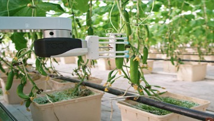

# The Future of Agriculture: AI harvesting robots have new flexibility skills

----------

## Abstract

Agricultural robotics and AI company Root AI has announced new features for its AI enhanced robotic harvester, plus more than $7 million.Today, robotic harvesters enhancing A I have shown increased flexibility to handle crops of various shapes and sizes, helping with technology to remedy those vulnerabilities.

In the past, the robotic harvester V i r go (was called Virgo) and harvesting ripe tomatoes from vines.In indoor agricultural environments, V i r go can be located on tracks between various crop lines.When the robot sails in the greenhouse, it uses a lot of sensors and artificial intelligence to analyze the location and maturity of crops, then uses specialized grichers to pick agricultural products when ready.In the latest video "G o i ng C r o ss-C r op", the robotic harvester V i r go shows picking cucumbers and strawberries in the field.The company called V i r go "the world's first robot to replicate people's ability to harvest multiple crops".

## Analysis

Poverty has become one of the long-standing dilemmas facing human civilization in the 21st century.According to world development indicators, about 42 percent of the world's population and nearly 2.6 billion people are living in poverty.An important premise for eliminating poverty is to identify poverty.As the case says, in economically backward countries and regions, governments are difficult to afford high economic research costs, some of which are still in political turmoil, and data on poverty is highly missing.This poses no big obstacle to international aid.Compared to traditional door-to-door surveys, the machine learning method combined with satellite imagery greatly reduces survey costs, and the data access channels almost all come from public information, making this method easier to generalize and replicate.

## Pictures

----------
 
 

