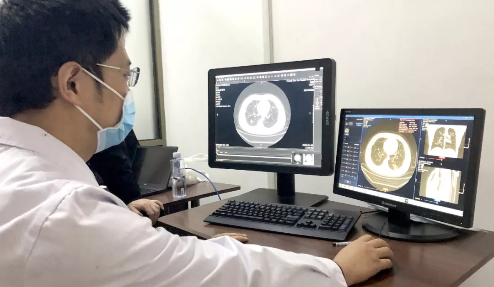
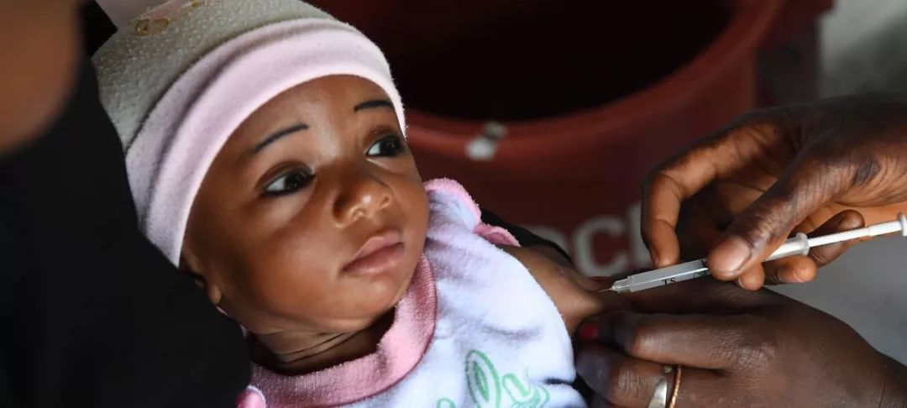

# 人工智能辅助诊断系统大显身手

----------

## 摘要

随着人工智能被纳入国家战略和“新基建”体系，AI技术将为助力我国医疗行业升级发挥积极作用。商汤不仅用AI为医生提供智能辅助工具，提升医院诊疗效能，同时也不断探索前沿，突破AI应用的边界，引领AI医疗行业的可持续发展。

从辅助诊疗、精准手术到药物挖掘，AI+医疗有着丰富的应用场景。以商汤SenseCare智慧诊疗平台为例，“省人、省时、省力、精准”是AI影像辅助诊断带给医院的四大价值。
正是秉承“立足医疗大数据、服务临床诊疗愈”这一理念，SenseCare智慧诊疗平台基于平台的可灵活拓展性，迄今已推出包含胸部CT、胸部X线、心脏冠脉、病理、骨肿瘤等多款产品解决方案，覆盖超过13个人体部位和器官，为多科室的临床诊疗需求提供AI助力，帮助临床医生进行高精度疾病检测、分型、良恶性预测等多维分析，以及3D术前规划与模拟等治疗方案的设计。

在今年新冠疫情期间，SenseCare胸部CT智能临床解决方案第一时间驰援北京、上海、天津、山东、河北、福建等多省市新冠肺炎重点筛查医院，高效、准确地为前线医务工作者提供决策依据。“我们通过引入商汤科技SenseCare肺部AI智能分析产品，能够实现对新冠肺炎CT影像的智能化诊断与定量评价，几秒内就能完成定量分析，自动筛查疑似。”青岛西海岸新区人民医院放射科主任王其军介绍说。王其军和团队能以最短的时间出具检查报告，避免人员长时间滞留，降低交叉感染风险，背后的秘密就是人工智能（AI）辅助诊断。

## 分析

看病难、看病贵的问题在中国十分突出，主要表现在两大方面，一是医疗资源分配不均。据统计，三级医院拥有目前医疗服务体系中近90%的高新设备和优秀医疗人员，基层医院的医疗设备严重不足、医生密度偏小、业务水平不高，限制了其诊疗能力，往往需要将患者转诊到大医院进行后续诊疗或采取保守治疗；二是基层医院门可罗雀，但三级医院和门诊日日人满为患，较低的医患比例使医生长期处在高压状态，医患关系紧张、纠纷频发。此外，结合本次突发新冠疫情，在应急状态下，依靠传统医疗模式无法应对“战时”医疗系统的峰值压力。

面对以上状况，通过供给侧改革，除增加医疗资源供给外，利用AI技术赋能，提高医疗资源的使用效率是快速缓解当下医疗资源不足的有效途径之一：

一，通过AI算法辅助医生诊疗，可大幅减轻医生负担，将所释放的精力和时间处理更紧急的事件、诊治更多的病患、与病患做更专注的交流，在减轻医疗系统压力的同时有利于医患关系的良性化发展。

二，AI算法实现了专家经验和知识图谱的数字化、标准化，可将其复制并输出，增加医疗资源的总体供给，快速提升基层医院的医疗水平，使得患者无论是在发达地区或是偏远地区，均可就近就医，享受到基本同质的医疗服务，促进医疗卫生资源均衡化发展。

人工智能在医疗领域的应用和推广，是商汤AI伦理原则的具体体现，也正符合联合国所倡导的可持续发展目标(SDG10和SDG3)——减少因资源不足和分配不均所造成的区域间差距和人与人间的不平等现象，确保每个人都有追求健康、幸福生活的权力。

## 图片

## 标签

公共卫生服务、医疗服务均等化（SDG10）、健康福祉(SDG3)

----------

 
 
