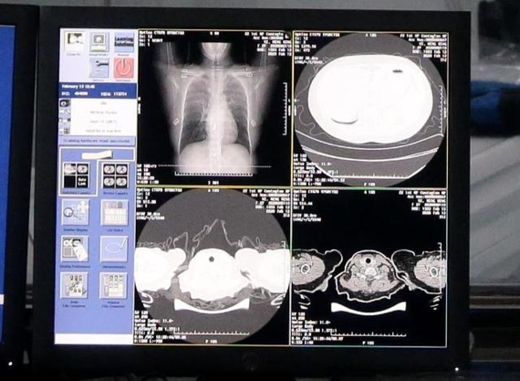

# AI 辅助诊断新冠肺炎

----------

## 摘要

2 月 15 日，阿里巴巴达摩院和阿里云联合出品 “新冠病毒肺炎 AI 辅诊助手”，它可以帮助医生快速进行疑似病例诊断，从而让 AI 在抗击疫情中大显身手。

具体来说，达摩院联合阿里云针对新冠肺炎临床诊断研发了一套全新的 AI 诊断技术，可在 20 秒内对疑似案例的 CT 影像进行判读，区分新冠肺炎、普通病毒性肺炎及健康的影像，根据纹理特征计算疑似新冠肺炎的概率，并直接算出病灶部位占比，分析结果准确率达到 96%。

在国家卫健委公布的第五版方案中，除核酸检测外，CT 影像临床诊断结果也可作为新冠肺炎病例判断的标准。

据了解，新冠肺炎患者的 CT 胸片的影像特征表现为单肺或双肺多发、斑片状或节段性磨玻璃密度影等细微变化。一位新冠肺炎病人的 CT 影像大概在 300 张左右，这给医生临床诊断带来巨大压力，医生对一个病例的 CT 影像肉眼分析耗时大约为 5 至 15 分钟。

为此，达摩院医疗 AI 团队基于当前最新的诊疗方案、钟南山等多个权威团队发表的关于新冠肺炎患者临床特征的论文等，与浙大一附院、万里云、长远佳和古珀医院等多家机构合作，率先突破了训练数据不足的局限，基于 5000 多个病例的 CT 影像样本数据，学习、训练样本的病灶纹理，研发了全新的 AI 算法模型。

## 分析

看病难、看病贵的问题在中国十分突出，主要表现在两大方面，一是医疗资源分配不均。据统计，三级医院拥有目前医疗服务体系中近90%的高新设备和优秀医疗人员，基层医院的医疗设备严重不足、医生密度偏小、业务水平不高，限制了其诊疗能力，往往需要将患者转诊到大医院进行后续诊疗或采取保守治疗；二是基层医院门可罗雀，但三级医院和门诊日日人满为患，较低的医患比例使医生长期处在高压状态，医患关系紧张、纠纷频发。此外，结合本次突发新冠疫情，在应急状态下，依靠传统医疗模式无法应对“战时”医疗系统的峰值压力。

面对以上状况，通过供给侧改革，除增加医疗资源供给外，利用AI技术赋能，提高医疗资源的使用效率是快速缓解当下医疗资源不足的有效途径之一：

一，通过AI算法辅助医生诊疗，可大幅减轻医生负担，将所释放的精力和时间处理更紧急的事件、诊治更多的病患、与病患做更专注的交流，在减轻医疗系统压力的同时有利于医患关系的良性化发展。

二，AI算法实现了专家经验和知识图谱的数字化、标准化，可将其复制并输出，增加医疗资源的总体供给，快速提升基层医院的医疗水平，使得患者无论是在发达地区或是偏远地区，均可就近就医，享受到基本同质的医疗服务，促进医疗卫生资源均衡化发展。

人工智能在医疗领域的应用和推广，是商汤AI伦理原则的具体体现，也正符合联合国所倡导的可持续发展目标(SDG10和SDG3)——减少因资源不足和分配不均所造成的区域间差距和人与人间的不平等现象，确保每个人都有追求健康、幸福生活的权力。

## 比较案例

> 疫苗之善: 呵护非洲孩子健康成长

全球疫苗免疫联盟（GAVI）的工作是为努力实现可持续发展目标，使世界最贫困的国家能负担得起并获得免疫疫苗。GAVI救援重点主要在治理脆弱、突发危机及收容大量难民的国家。

萨赫勒地区是非洲南部撒哈拉沙漠和中部苏丹草原之间的一条狭长的地带，横跨塞内加尔、毛里塔尼亚、马里、布基纳法索、尼日尔、尼日利亚、乍得、苏丹共和国和厄立特里亚9个国家，是“脆弱”国家的聚集地。在这里，恐怖袭击、人口贩运、毒品交易、土地荒漠化、环境恶化、粮食短缺等危机并存。据统计，在乍得和马里两个国家就有60万儿童从未接种过疫苗，而毛里塔尼亚、尼日尔、塞内加尔、布基纳法索等国的儿童免疫数据仍无法获得。

在极端困难的条件下，GAVI支持当地政府和民间组织，克服困难，推进工作，使马里接种疫苗儿童的人数从2001年的7.9万增加到如今的200多万。在各方努力下，冲突地区不仅维持着儿童接种记录，有些地区还提高了儿童免疫接种率。

## 图片

## 标签

公共卫生服务、医疗服务均等化（SDG10）、健康福祉(SDG3)
