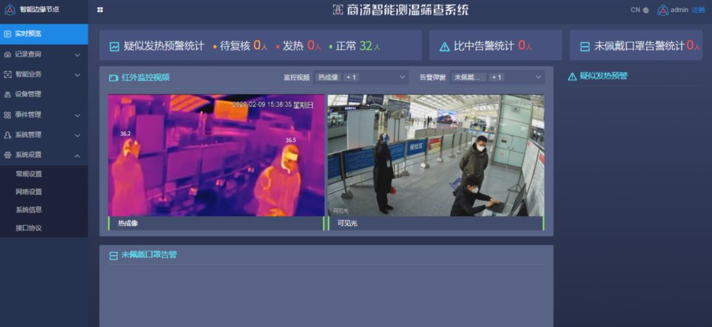

# AI的检测与预防

----------

## 摘要

除了针对密切接触者和疑似感染者，大城市的复工也是一个传染隐患。在病毒的“隔绝”过程中，人工智能的优势被发挥的淋漓尽致。首先是测量体温，尽管目前，超市、公司等场所都配备了遥感体温计，但对于人流量较大的公共场所来说，短时间内用耳温枪/额温枪等体温检测仪对通行人员逐一测量压力巨大，热成像设备作为非接触式测温工具，可覆盖较大区域，提升通行速度，减少群体聚集时间。不过，热成像摄像机传感器普遍分辨率较低，距离较远时拍摄到的可用像素很少，如行人佩戴口罩、眼镜，以及有刘海遮挡额头或戴帽子时，也会对测温带来一定程度的干扰，这给当前的防疫工作带来了一定挑战。

为此，商汤AI智慧防疫解决方案的区域通行模块，创新地将AI技术应用到热成像测量当中。由商汤星云系列智能测温筛查终端、热成像摄像机、黑体和智能测温筛查系统组成的软硬一体解决方案，让防疫工作的开展更高效、更精准！商汤AI算法融合了红外成像和可见光成像技术，基于商汤高精度的人体温度平滑模型，可有效减少热成像相机温度漂移问题，实现±0.3℃以内的行人额温测量精度，并可进一步降低测温系统对于黑体的依赖，从而在某些无法使用黑体的场景中确保应用效果的可靠性，满足疫情防控初步筛选疑似患者标准。当检测到疑似体温超过37.3°C的人员时，系统会及时抓拍并进行声光和弹窗提醒，便于进行二次核验。

## 分析

AI与热成像技术结合，实现了对人流密集区域进行快速、大面积的“非接触式”测温筛查，相较传统测温方式，极大的提高了防疫工作效率，对异常情况及时发现并加以控制，降低人员聚集区交叉感染风险，在新冠疫情防控工作中发挥了重大作用。这套系统的使用也符合商汤所倡导的AI惠民原则以及联合国所倡导的人类健康福祉目标（SDG3），利用技术手段高效防疫，提升国家对健康风险的控制能力。

## 图片

## 标签

公共卫生服务、健康福祉（SDG3）

----------

 
 
 
 
