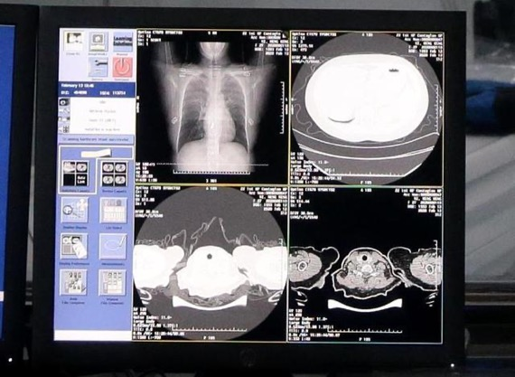

# Using machine learning plus satellite, Stanford can identify poor areas from space

----------

## Abstract

On February 15, Alibaba Damore Hospital and Ali Cloud jointly produced the "COVID-19 A I Auxiliary Diagnosis Assistant", which can help doctors quickly diagnose suspected cases, thus making AI excel in the fight against the epidemic.

Specifically, damhospital joint ali cloud for COVID-19 clinical diagnosis developed a new A I diagnosis technology, can read in 20 seconds of CT image, distinguish COVID-19, common viral pneumonia and healthy image, according to the texture characteristics of suspected COVID-19, and directly calculate the proportion of lesion site, the analysis results accuracy reached 96%.

In the fifth version of the protocol released by the National Health Commission, in addition to nucleic acid testing, the clinical diagnosis of CT imaging can also be used as the criterion of COVID-19 cases.It is understood that the imaging characteristics of CT chest slices in COVID-19 patients show subtle changes such as multiple single or double lungs, plaque shape or segmental ground glass density shadow.A COVID-19 patient has about 300 CT images, which puts great pressure on the clinical diagnosis, and the visual analysis of the CT images of a case took about five to 1 5 minutes.

To this end, Dharma medical A I team based on the current latest treatment, zhong authoritative team published on COVID-19 patients clinical characteristics, etc., and zhejiang university, cloud, long-term good and Cooper hospital institutions, take the lead to break through the limitations of insufficient training data, based on more than 5000 cases of CT image sample data, learning, training sample lesion texture, developed a new AI algorithm model.

## Analysis

The problem of difficult and expensive medical treatment is very prominent in China, mainly manifested in two aspects. One is the uneven distribution of medical resources.According to statistics, tertiary hospitals have nearly 90% of high-tech equipment and excellent medical personnel in the current medical service system. Serious insufficient medical equipment, low doctor density limit limited treatment ability and often need to be referred to large hospitals for subsequent diagnosis and treatment or conservative treatment; Second, primary hospitals are crowded, but tertiary hospitals and clinics are overcrowded every day, and the low proportion makes doctors under high pressure and disputes.In addition, combined with the sudden COVID-19 outbreak, the peak pressure of the "wartime" medical system cannot be met by relying on the traditional medical mode.

In the face of the above situation, through the supply-side reform, in addition to increasing the supply of medical resources, the use of A I technology to improve the use efficiency of medical resources is one of the effective ways to quickly alleviate the current shortage of medical resources:

First, through the AI algorithm to assist doctor diagnosis and treatment, can greatly reduce the burden on doctors, release the energy and time to handle more urgent events, diagnose and treat more patients, do more focused communication with patients, while reducing the pressure of the medical system is conducive to the benign development of doctor-patient relationship.

Second, the A I algorithm implements the expert experience and knowledge map digital, standardization, can copy and output, increase the overall supply of medical resources, quickly improve the medical level of grassroots hospitals, make patients in developed or remote areas, can be nearby, enjoy the basic homogeneous medical services, promote the balanced development of medical and health resources.

The application and promotion of artificial intelligence in the medical field is the concrete embodiment of SenseTime's A I ethical principles, and is also in line with the UN advocated Sustainable Development Goals (S D G 10 and S D G 3) —— to reduce the regional gap and human inequality caused by insufficient resources and uneven distribution, to ensure that everyone has the power to pursue a healthy and happy life.

## Pictures

----------
 
 

