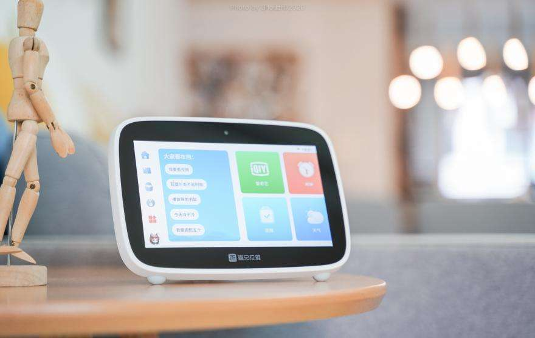

# 喜马拉雅首款带屏智能硬件小雅AI图书馆正式发售

----------

## 摘要

2020年8月6日晚20点，喜马拉雅发布首款智能屏硬件新品——小雅AI图书馆. 小雅AI图书馆的出现，可以随时随地触发阅读。健身、跑步、开车、做家务的时间都能变成阅读的时间，人们获取信息和知识也将变得更加容易。小雅AI图书馆会根据用户的收听习惯推荐适合的内容，百位内容专家为全家人严选好内容，与喜欢的好内容不期而遇。

通过小雅AI图书馆的前置摄像头扫描书籍封面，小雅会在海量内容库匹配有声资源，用户可以把想要听的有声书填加到云书架。

小雅AI图书馆可以智能感应主人回家，支持一语自动续播功能，让阅读无缝延伸到生活。未来，小雅AI图书馆还将支持早安、晚安等多种智能化内容场景，提供更多人性化的使用体验，让好内容流出来，让阅读每时每刻伴随着用户。

## 分析

教育公平是社会公平的基础和人生公平的起点。联合国提出了面向未来的全球可持续发展目标，其中之一就是优质教育：要求各国确保包容、公平的优质教育，促进全民享有终身学习机会。

小雅AI图书馆通过人工智能技术降低了人们获取知识的门槛，拓宽了学习的边界，无论是耄耋老人、小孩还是一些阅读或视力障碍者都可以通过“听读”方式更加便捷的获取适合自己的好内容,与普通人一样享有终身学习机会。与此同时，通过AI手段也可以降低教育资源的稀缺性，让贫困地区人们都有同等获取知识的权利和机会，实现教育公平，有助提高国家的整体教育水平和国民素养，为经济发展打下扎实的人才基础。

## 图片

## 标签

教育公平（SDG4）

----------

 
 
 
 
