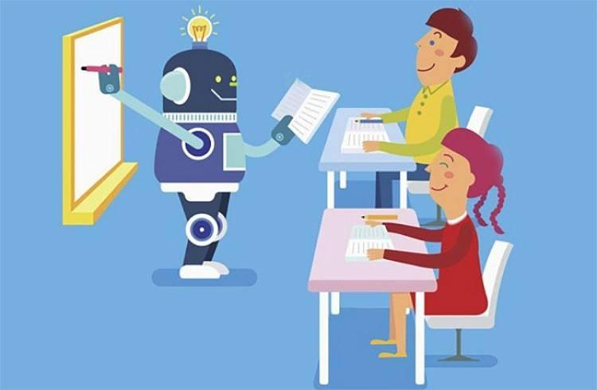

# 商汤科技护航百区千校中小学，AI基础教育普及不“掉线”

----------

## 摘要

受疫情影响，对于广大师生来说，如何在有效防控疫情的前提下确保教学工作正常开展成了首要考虑的大事。

全球领先的人工智能平台公司商汤科技为各省市百区千校的师生制定“AI基础教育涨知识在线学习”解决方案，包含AI科普视频、Sense Study AI实验平台、AI教师培训视频与直播、商汤泰坦公开课、第二届国际中学生人工智能交流展示会、在线远程教学产品解决方案等产品和服务。该解决方案面向有需求的中小学免费提供，确保正式开学后，在不额外增加学生学业负担基础上，科普AI前沿知识，进一步提高师生AI认知水平。

## 分析

新冠肺炎疫情给全球教育带来前所未有的挑战，全球超过10亿学生受到疫情影响无法正常到校学习。在此期间各国高校纷纷通过在线教学力求“停课不停教，停课不停学”，上演了一场规模空前的线上教学实践。经过此次疫情的历练和探索尝试，使得教育教学与互联网、AI技术的深度融合达到了前所未有的高度。而老师们通过前期的快速培训和在线授课的实践，也同步提高了信息化素养，为长期化、规模化在线教育的普及打下了基础。

人工智能与教育的实践探索普惠每一个学生，类似商汤科普AI的远程教学产品，让知识的传播不再有门槛，让知识的普及不“掉线”，更让偏远地区的孩子们也能够享受最好的教育资源和课程，真正实现了优质教育资源的公平权利。

## 比较案例

> 用真爱实现公平教育的梦想

自2008年成立以来，上海真爱梦想公益基金会（以下简称“真爱梦想”）遵循“发展素养教育，促进教育公平”的教育公益理想。创始人潘江雪从项目初始，就希望做成可复制的公益产品，构建从形式到内涵统一的标准化模式。

经过多年探索，真爱已经形成了以“梦想中心”的硬件设施建设为中心，四个软件服务产品为辅助的一整套标准化项目框架，其中“梦想中心”是一个集网络、多媒体、图书和课堂为一体，设计独特的，分布在各个偏远地区学校中的标准化教室，而四个服务型软件分别为梦想课程、梦想领路人、梦想银行和梦想盒子。

真爱将标准化的制度设计融入在硬件支持、软件服务中各个环节，这样才可以将整套的项目框架进行大规模复制，且达到有效管理和持续服务的最终目的。截至目前，已建起3500多所梦想中心，让全国近650个区县、超过360万的孩子受益。

## 图片

## 标签

教育公平（SDG4）、优质教育

----------

 
 
 
 
