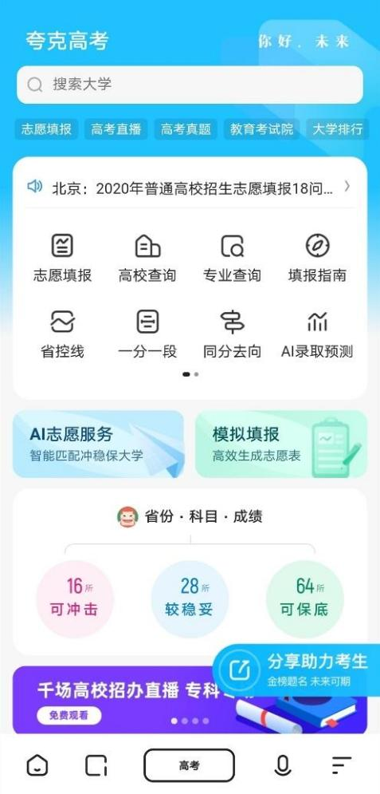

# AI搜索技术赋能高考志愿填报

----------

## 摘要

夸克搜索提供了智能匹配、AI录取预测、模拟填报、职业性格测试、高校PK，以及新高考选科等全流程的AI工具。其中，AI录取预测引入细分的高校和专业维度，大幅提升智能预测分析的指导价值。模拟填报+AI分析建议，给予考生更为直观的志愿决策辅助。

数据显示，一系列夸克独家自研的AI工具，以极强的专业性和实用性，让高考AI工具整体使用量较去年同比增长8倍，高校查询、专业查询、估分、AI录取预测、性格测试等人气最高。

同时，夸克高考模拟填报推出的志愿单管理功能，将高校、专业和城市，匹配考生的分数、兴趣、就业，实际生成志愿单的考生超过300万，相当于2020全国高考中，每三个考生就有一个在使用夸克高考AI志愿填报服务。

## 分析

高考志愿填报可能关系到学生未来的定位和发展。面对近3000所高校、超过500个未知专业方向，以及专业毕业后的职业趋势和发展方向，对于很多家庭和高考生来说都是一个所含信息量极大、且极为复杂的人生抉择，专业、可信的针对性指导从来都是稀缺品，只有少数人可以获得。利用AI技术手段进行高考志愿填报,可以让每个人都有机会获得高质量、个性化的分析与建议，在面对人生重要选择的时候做到公平竞争。

## 比较案例

> 用真爱实现公平教育的梦想

自2008年成立以来，上海真爱梦想公益基金会（以下简称“真爱梦想”）遵循“发展素养教育，促进教育公平”的教育公益理想。创始人潘江雪从项目初始，就希望做成可复制的公益产品，构建从形式到内涵统一的标准化模式。

经过多年探索，真爱已经形成了以“梦想中心”的硬件设施建设为中心，四个软件服务产品为辅助的一整套标准化项目框架，其中“梦想中心”是一个集网络、多媒体、图书和课堂为一体，设计独特的，分布在各个偏远地区学校中的标准化教室，而四个服务型软件分别为梦想课程、梦想领路人、梦想银行和梦想盒子。

真爱将标准化的制度设计融入在硬件支持、软件服务中各个环节，这样才可以将整套的项目框架进行大规模复制，且达到有效管理和持续服务的最终目的。截至目前，已建起3500多所梦想中心，让全国近650个区县、超过360万的孩子受益。

## 图片

## 标签

教育公平（SDG4） 

----------

 
 
 
 
