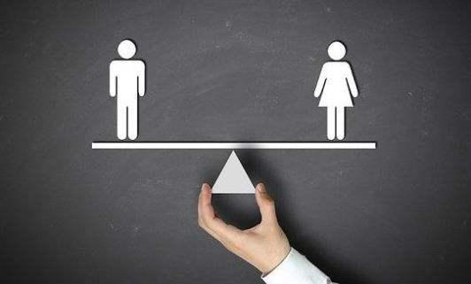

# The UN CGF "Gender equality" project was launched

----------

## Abstract

With the mission of "Let data technology serve the well-being and freedom of people", Mana Data Foundation thus launched the "Promoting Gender Equality for AI algorithms" project, which is to explore the new characteristics and trends of gender equality in the era of artificial intelligence.The project was supported by the ninth batch of the United Nations-China Social Gender Research and Advocacy Fund (CGF).

Project head first listed the face recognition, intelligent recruitment, finance and other fields of artificial intelligence algorithm sex discrimination cases, then with the help of social constructionism, social data and technology feminist theoretical framework analysis artificial intelligence algorithm two causes of sex discrimination, namely social influence further solidified into the algorithm, artificial intelligence technology of "female perspective" in innovation.Finally, put forward four action programs: moral algorithm, algorithm transparency: establish algorithm review and evaluation mechanism, to users to do algorithm interpretation, introduce algorithm design female perspective, break the inherent gender discrimination, as well as basic research and academic advocacy, ability building and policy and social advocacy and other major intervention measures.

## Analysis

Algorithm as the core of artificial intelligence, bring human opportunities also brought some risks, in the actual application process will often appear bias conclusion or feedback, the most typical is "algorithm discrimination" phenomenon is more serious, to a kind of social groups invisible unequal treatment, such as gender mentioned in case bias.Therefore, when algorithmic discrimination collides with the rational value of human beings, the problems brought about deserve our vigilance.

On the one hand, "algorithmic discrimination" is rooted in the reflection of the inherent social bias in human beings, and on the other hand, data is also one of the key variables, mainly coming from the one-sidedness of data collection.To overcome the adverse consequences of algorithmic discrimination, we should not only establish a set of ethical review standards for A I algorithms based on prohibiting discrimination or equal protection purposes, but also enhance the transparency of intelligent algorithms.

As Danella Keats Sittram noted in his paper Technical Due Process, "Given that intelligent algorithms increasingly determine the results of various decisions, people need to construct technical fairness specification systems, ensure fairness realization through procedural design, and strengthen the transparency, cenability and interpretability of intelligent decision-making systems with the legitimacy of technical procedures".

## Pictures

----------
 
 

