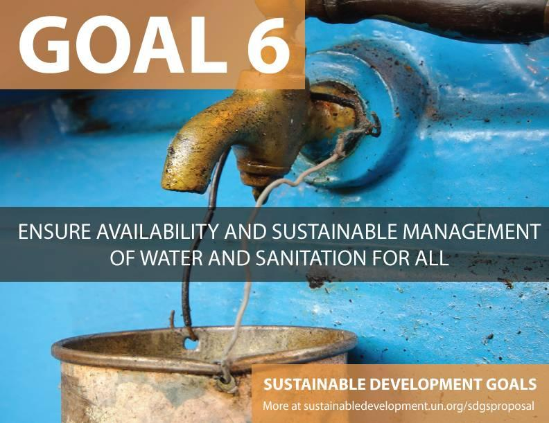

# 智慧水务：未来城市居民饮用水新趋势

----------

## 摘要

2017年，银川市着力打造智慧社区，至简水务投资承担的当地管道直饮水工程，有序覆盖银川80多个社区、政府大楼、学校和医院，惠及近几十万用户，彻底解决了当地多年饮水差、用水难的问题，中央电视台为此专门进行了专题报道。

据至简水务投资副总裁蒋建华介绍，公司非常重视新技术和新材料的研究开发，其核心技术主要是基于空气动力水体分离系统和多层再生分离系统，通过大数据和人工智能手段，实时在线水质监测，另外，公司会定期请第三方机构进行水质检测，提供全面的水质检测报告。

## 分析

饮用水安全是中国的当务之急。在水质较差的地区会带来健康和社会问题。在中国，每年有1.9亿人患病、6万人死于水污染引起的疾病（比如肝癌和胃癌）；大约有3亿人面临饮用水短缺。在对全国的198个城市地下水抽查检测中，结果较差、极差的检测点占比例为57.3%，水质问题已经成为我们的健康隐患。 

水质监测信息是水质情况的直接反映，对整个水环境保护、水污染控制乃至维护水环境健康方面起着至关重要的作用。传统的水质监测主要采用现场人工采样和实验室仪器分析的方法。这种方法不仅效率低,采样误差大,而且还不能及时反映水质变化情况。应用人工智能对水质状况进行实时监控、智能化检测并及时预警做出防范,对水污染问题从源头上进行把控,可最大程度减轻水源污染问题，保证居民饮用水安全。

## 比较案例

> 雀巢大山饮用水公司的可持续水管理

2018年9月，雀巢饮用水旗下云南大山饮用水工厂顺利获得国际水管理联盟（AWS，The Alliance for Water Stewardship）黄金级认证。AWS联盟致力于推广、鼓励和引导可持续且负责任的水资源开发利用方式。

大山工厂位于云南省农村地区，当地含水层极易受季节性降雨变化的影响，任何过度用水都会对当地所有用水者造成直接影响。雀巢饮用水收购大山之后，团队很快确定了行动方案，以行之有效的方式着手解决当前水资源面临的最紧迫挑战。初步计划包括改进水井在线监测、更深入地分析动态水位、并确保工厂的取水量始终低于最大限度。经过10年的持续努力，工作已取得成效，水位已经稳定下来。雀巢还重点推动自己的供应商开展节水和环境改善，并与工厂附近的社区进行交流互动、提升基础设施。

凭借大山取得的认证，雀巢饮用水现在全球共有12家工厂通过AWS标准认证。因为AWS认证可以鼓励公司团队不断挑战和改进自己的水资源管理方式，雀巢饮用水做出承诺，即到2025年实现旗下的所有工厂全部通过认证。雀巢饮用水对可持续水管理的承诺，助推了雀巢集团对联合国可持续发展目标中关于水的第六条目标（即SDG6）的贡献，和集团对水资源的可持续管理。

## 图片

## 标签

饮用水安全、可持续水管理、清洁饮用水和卫生设施（SDG6）

----------

 
 
 
 
