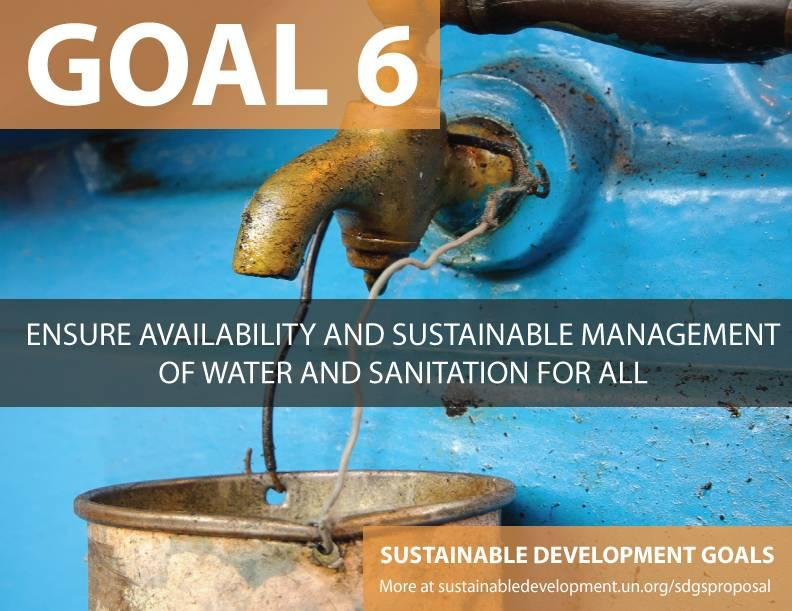

# Smart water: a new trend of drinking water for urban residents in the future

----------

## Abstract

In 2017, yinchuan strive to build wisdom community, to Jane water investment to local pipeline direct drinking water project, orderly covers more than 80 communities in Yinchuan city, government buildings, schools and hospitals, benefiting nearly hundreds of thousands of users, completely solved the problem of poor drinking water, water for many years, CCTV for a special report.

According to Jane water investment, vice President of Jiang Jianhua, the company attaches great importance to the research and development of new technology and new materials, its core technology is mainly based on aerodynamic water separation system and multilayer regeneration separation system, through big data and artificial intelligence, real-time online water quality monitoring, in addition, the company will regularly ask a third party water quality testing, provide a comprehensive water quality detection report.

## Analysis

Drinking water safety is a top priority in China.Health and social problems arise in areas with poor water quality.In China, 190 million people get ill and 6 0,000 die from water pollution (such as liver cancer and gastric cancer); about 3 00 million people face drinking water shortages.In the spot check and testing of groundwater in 198 cities across the country, the poor and extremely poor testing points accounted for 57.3%, and the water quality problem has become our health hazard.

Water quality monitoring information is a direct reflection of the water quality situation, and plays a vital role in the overall water environmental protection, water pollution control and even maintenance of water environmental health.Traditional water quality monitoring mainly adopts the method of field manual sampling and laboratory instrument analysis.This method is not only inefficient and has a large sampling error, but also does not timely reflect the water quality changes.The application of artificial intelligence to conduct real-time monitoring, intelligent detection of water quality conditions and timely early warning to make precautions, to control the water pollution problems from the source, can minimize the problem of water pollution, to ensure the safety of residents' drinking water.

## Pictures

----------
 
 

