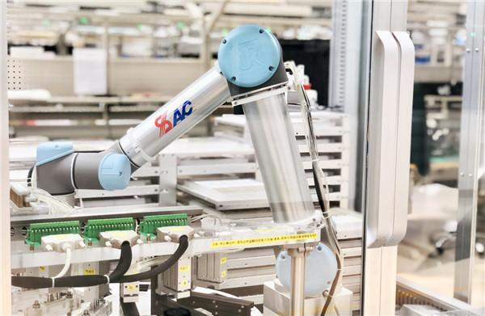

# 喜马拉雅首款带屏智能硬件小雅AI图书馆正式发售

----------

## 摘要

融合基础设施是新基建的重要内容之一，主要是指深度应用互联网、大数据、人工智能等技术，支撑传统基础设施转型升级，进而形成的融合基础设施，比如，智能交通基础设施、智慧能源基础设施等。
3月29日，南方电网全网统调最高负荷1.39亿千瓦，全网统调发售电量为27.38亿千瓦时。在此前一天，“南方电网调度驾驶舱AI负荷预测模板”已经测算出这些数据。

AI技术应用到负荷预测上，仅是智能技术融入南方电网生产领域的一个例子。按照“智能装备、智慧运行”推广应用思路，“十四五”期间，南方电网公司将重点推广图像智能识别、无人机自动巡检、电缆隧道机器人巡检、光纤振动在线监测等成熟技术，试点推进北斗高精度定位、无人机集群作业、两栖机器人巡检作业等新技术应用。

## 分析

我国电力发展的基本方针是：提高能源效率，保护生态环境，加强电网建设，大力开发水电，优化发展煤电，积极推进核电建设，鼓励新能源发电，深化体制改革。在此方针的指导下，我国在智能化电网投资方面占比越来越大，根据《国家电网智能化规划总报告》，2009-2020年国家电网总投资3.45万亿元，其中针对智能电网的投资额高达3841亿元，占电网总投资的11.1%，而且，按不同时间阶段划分，越到规划后期，智能化投资占比越高。这表明我国电网的发展正在朝着智能化方向发展。可以预见，未来我国电力发展将呈现自动化水平高、经济高效和环保、技术进步和产业升级步伐加快的显著特点。

将 AI 技术应用到电力行业中，不仅是电力行业发展的必然选择，也是能源电力转型的重要战略支撑。人工智能技术在电网建设、经营、决策、管理（运维）等领域中具有广阔的应用前景，将对提高电网调度能力、改善电力能源使用效能、保障能源安全，更好地服务经济社会发展发挥积极的作用，这也符合联合国所倡导的可持续发展目标SDG7，确保人人获得负担得起、可靠和可持续的现代能源。

## 比较案例

> SDG

公用电网上传输的电力可能来自煤电、水电、核电、风电和光伏发电等，但是无论采取何种方式进行发电，所输出的电力必须并入电网才能够输送给终端用户使用。用户在用电的时候无从区分所用的电是来自于常规的化石能源还是可再生能源，这就会导致对于新能源的鼓励政策没法真正实施。为了解决这个问题，美国环境保护局于上世纪90年代提出可再生能源配额制度（Renewable Portfolio Standard-RPS）。

可再生能源配额制度是指一个国家或地区用法律的形式，强制性规定可再生能源发电在总发电量中所占比例，并要求电网公司对其全额收购，对不能满足配额要求的责任人处以相应惩罚的一种制度。而可再生能源证书（Renewable Energy Certificate-REC）制度，又称绿色电力证书制度，是基于可再生能源配额制度的一项政策工具，配额制的实施需要和可再生能源证书交易市场配套运行，购买RECs 是实现RPS的一种手段，也是实现RPS 的一种证明。

一般而言，1 REC代表着有1 MWh由可再生能源所发的电。通过这项规定，使得每兆瓦上网的绿色电力都具有独特的标识代码证书，并在证书上标注该符合资格的可再生能源电力的类别、发电容量、生产时间和生产序列号等发电信息。从而，可再生能源证书REC被赋予环境效益和社会效益的价值，体现为可再生能源生产电能时获得的环境属性。若要将这种环境属性货币化，就需要进行交易。

以上案例通过制度设计以鼓励可再生能源政策的实施和推进，有利于提高可再生能源在全球能源结构中的比例，促进能源结构的进一步优化。

## 图片

图：中国华电下属南京国电南自自动化有限公司的生产车间

## 标签

智能电网、清洁能源、可再生能源、可持续能源（SDG7）

----------

 
 
 
 
