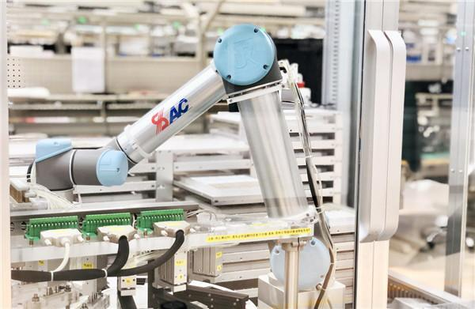

# Artificial intelligence quickly integrates into the power grid

----------

## Abstract

Integrated infrastructure is one of the important contents of the new infrastructure, which mainly refers to the deep application of the Internet, big data, artificial intelligence and other technologies to support the transformation and upgrading of traditional infrastructure, and then form the integrated infrastructure, such as intelligent transportation infrastructure and smart energy infrastructure.

On March 29, the maximum load of 13 9 million kilowatts, and the power volume was 2.738 billion kilowatt-hours.The day before the day, the "China Southern Grid Schedule cockpit AI load forecast template" had calculated these data.

The application of A I technology to load prediction is only an example of intelligent technology integration into the production field of China Southern Grid.According to the "intelligent equipment, intelligent operation" promotion application ideas, "difference" period, the southern power grid company will focus on promoting image intelligent recognition, UAV automatic inspection, cable tunnel robot inspection, fiber vibration online monitoring mature technology, pilot promote the beidou high-precision positioning, UAV cluster operation, amphibious robot inspection operation and other new technology application.

## Analysis

The basic policy of China's electric power development is to improve energy efficiency, protect the ecological environment, strengthen power grid construction, vigorously develop hydropower, optimize coal power, actively promote the construction of nuclear power, encourage new energy power generation, and deepen institutional reform.Under the guidance of this policy, China accounts for a more and more large proportion in intelligent grid investment. According to the State Grid Intelligent Planning General Report, the 2009-2020 State Grid invested 3.45 trillion yuan, among which 384.1 billion yuan, accounting for 11.1% of the total grid investment, and, according to different time stages, the later planning, the higher the proportion of intelligent investment.This shows that the development of the Chinese power grid is developing towards the intelligent direction.It can be predicted that in the future, China's electric power development will show the remarkable characteristics of high automation level, economic efficiency, environmental protection, technological progress and accelerated industrial upgrading.

The application of A I technology to the power industry is not only an inevitable choice for the development of the power industry, but also an important strategic support for energy and power transformation.Artificial intelligence technology in power grid construction, management, decision- making, management (operations) and other fields have broad application prospects, will improve the grid scheduling ability, improve power energy efficiency, ensure energy security, better serve economic and social development, which is also in line with the United Nations advocated sustainable development goals SDG7, to ensure that everyone obtain affordable, reliable and sustainable modern energy.

 

## Pictures

Photo: Production workshop of Nanjing Guodian Nanzi Automation Co., Ltd. under China Huadian

----------
 
 

