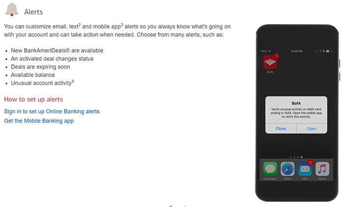

# 银行使用AI的另一种方式是发送移动警报以帮助防止欺诈

----------

## 摘要

银行使用AI的另一种方式是发送移动警报以帮助防止欺诈。例如，如果您的帐户发生了一笔异常大的交易，则您的手机上可能会收到警告警报。或者，如果您突然开始以其他状态进行购买，则可能会被标记为预防欺诈，要求您致电银行以亲自验证购买。

由于跟踪您的日常财务交易，因此可以进行此类通知，从而使AI能够识别您的消费习惯中的异常模式。

## 分析

普惠金融意味着大量的普通民众将会融入金融体系之中，与此同时，金融用户群体的下沉也意味着更多的客户可能会面临或遭受金融欺诈等安全风险的威胁。在普惠金融时代，金融数据的量级与层次远超用户想象，人工核查的方式在响应速度与成本上，远远不能满足金融反欺诈的需求。最好的方式是依靠大数据、AI技术能力，从海量的金融数据中快速甄别可疑数据，达到确保用户本人真实、提交信息真实、金融需求和用途真实这三个目的。只有在高效防治金融欺诈、降低违约等金融风险的前提下，才能推动普惠金融可持续发展目标的真正落实。

## 图片

## 标签

普惠金融、包容性和可持续经济增长、促进生产性就业和体面工作（SDG8）

----------

 
 
 
 
