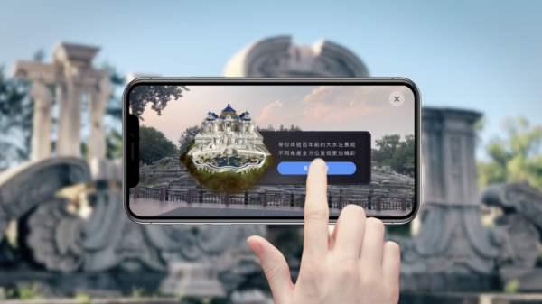

# AI赋能旅游新体验

----------

## 摘要

商汤科技希望通过AR增强提高旅游的品质。AR可以帮助我们进行场景的还原，实现历史重现，提升游览体验。通过三维的场景重建,可以实现AR导航，游客可以和虚拟的玩具龙进行互动，得到三维场景的理解，也可以加载各种的装饰和互动。

商汤科技还开发的AR数字人的技术，可以提供私人订制的旅游服务，可以带领游客了解旅游景点，讲解历史典故，讲周边比较有意思的事情，和客户进行互动。它能够对人进行识别和分析，能够理解我们的语言，跟人进行对话，还有肢体的互动。数字人也可以进行客群的分析，能够提供智能的服务，替代日常繁琐的工作。可以根据景区需要、客户需要，自动生成客户形象，定制化的数字形象。

## 分析

旅游业对国家经济与社会发展的贡献和拉动作用日益突出，是国家稳定经济增长，促进国民消费，调整产业结构的重要产业。在“十二五”期间，旅游业对于交通运输业增加值、住宿业增加值、民航运输及辅助服务业的拉动贡献均超过80%，是现代服务业中发展最为活跃的产业之一。

然而，目前我国文化旅游发展模式还是以资源要素驱动为主，其发展主要依托对在地历史文化资源的“透支性”开发，投资也主要集中在景区的基础设施和公共服务体系等大体量重资产投资方面，对历史人文缺少深度挖掘，形式（商业）过重、内容（文化）不足。而在需求方面，随着人们物质生活的丰富，旅游形态也从过去的“走马观花”式向以文化体验消费转变。供给侧的相对滞后导致游客体验不佳，不利于当地的文化输出和旅游业的可持续发展。

通过人工智能、增强现实等技术赋予文化旅游新的功能和体验。由AR、AI所构建的沉浸式体验场景，为游客带来颠覆性交互体验，让游客在虚拟和现实的叠加态中真实感受在地的历史人文，形成以体验为核心的高附加商业价值，推动传统的旅游消费方式向现代的文化旅游体验消费方式转变。

## 图片

## 标签

文化旅游、生产性就业、体面工作（SDG8）

----------

 
 
 
 
