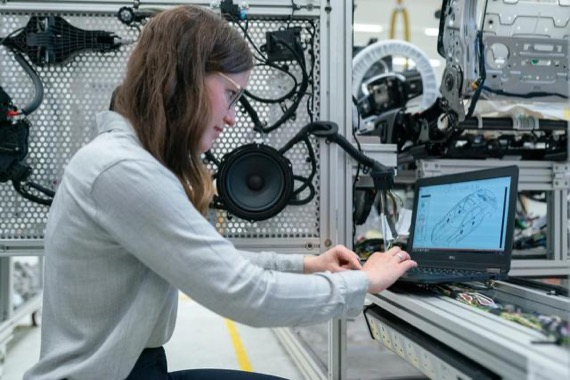

# 「智能感知与交互」的工业化进程

----------

## 摘要

智能感知与交互可分为两大能力，即视觉、听觉、触觉等机器感知能力和语音、动作等人机交互能力，前者偏向于感知识别，后者偏向于应用场景。

智能感知大多是通过物理世界中的摄像头、麦克风或者其他传感器的硬件设备作为传输“介质”进行信息传递，这些“介质”将输入内容映射到数字世界，对其进行认知、理解、记忆、规划、决策等。

人机交互则是在特定场景，依靠各种感知硬件设备实现即时交互或其他信息的传递。比如在自动驾驶领域，就是通过激光雷达等感知设备和AI算法，实现这样的感知智能的。家庭智能音响也是语音识别与交互的应用，通过学习特定的语境图谱来实现与人的交互功能。

未来，智能感知与交互会应用与更多的工业场景，包括仓储、物流、港口、化工、能源等，在机械化程度高等领域智能感知交互可以发挥更大的功效。

## 分析

每一次科技革命只有与工业制造深度结合，推动制造模式和生产组织方式的根本性变革，才能带动生产力的飞跃。人工智能的战略性地位和头雁效应，更应体现在与工业制造的深度融合上，由此推动产线、车间、企业的根本性变革，重塑生产运营、产品服务、组织流程等业务场景，打造产业创新业态，推动工业产值和就业的稳步增长。

## 比较案例

> 非洲乌干达探索工业化转型之路

在联合国可持续发展目标SDG9指导下，促进包容可持续工业化，到2030 年，根据各国国情，大幅提高工业在就业和国内生产总值中的比例，使最不发达国家的这一比例翻番。

非洲乌干达是东非共同体成员国之一，以农业经济为主。近年来，在发展中为了应对一系列挑战，当地政府一直在探索转型发展之路，并将工业化确定为实现可持续发展经济的重要途径。
中国辽宁省发达的制造业和加工业，恰好可以弥补乌干达发展的短板，乌干达园区通过积极引导辽宁优势企业入驻，为乌干达加快工业化发展进程贡献力量。

目前，园区的建立创造了大量就业机会，将吸纳当地不低于15000人就业。如园区经营瓷砖生产、食品加工、电缆生产的企业，雇佣当地员工2500余人。

园区企业大部分使用乌干达本地生产原料，引入现代化工艺及高科技设备，产品在满足本地需求的同时，还出口到国外市场。如瓷砖厂改变了乌干达瓷砖完全依赖进口的历史，约40%产品出口周边国家，增加了乌干达外汇收入。

园区企业在带动工业发展的同时，也在促进农业科技、勘探、建筑工程、仓储物流等相关行业的发展，并提高了当地居民收入。如已落地入驻园区的芒果干厂与当地农民签订芒果种植定向合同，提供优良的树苗品种，以及必要的种植技能培训，优化果实产量和质量，大大提高且稳定了果农收入。

## 来源

<a href="https://www.toutiao.com/a6820304865386824206/ " target="_blank">点击打开</a>

## 图片

## 标签

智能制造、可持续工业化（SDG9）
