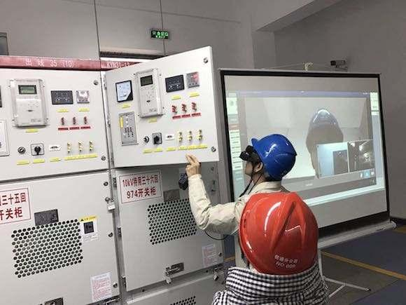

# 南方电网首个工业级视觉定位AR技术试点研究

----------

## 摘要

南方电网首个工业级视觉定位AR技术试点研究。南方电网超高压公司打造智慧换流站，通过AR技术将实现换流站值班员通过巡检人员现场工作第一视角画面，实时获知现场人员位置、作业进展情况。

后期在构建换流站AR环境地图，关联设备运行维护信息，叠加外部环境信息（如火灾、台风等），巡检人员通过AR眼镜，借助语音、手势识别等交互技术，实现现场作业的远程指导、培训及应急演练等。超高压公司联合国内顶尖AI技术企业花费5天时间完成流站二位信息动态采集。视觉定位辨识精度达到5厘米，为国内最高水平。

## 分析

电力设备的运行状态和电力供应质量有着至关重要的联系。为了确保电力的稳定供应，提高电力资源的使用效率，对电力设备状态进行检修是非常必要的。根据美国电力研究院和施工规范协会的统计数据表明，在电网系统实施状态检修可以提高设备利用率2%~10%，节约检修费用25%~30%，延长设备使用寿命10%~15%。专业巡检作为判断设备是否健康的重要数据来源，是电力设备状态检修中起到关键作用。

传统人工巡检存在人工耗费大、工作效率低、巡检不到位，以及伪造巡检数据或数据统计不完善等问题，导致不能及时发现设备故障，影响电力的稳定供应。AR技术在巡检工作中的应用，实现巡检路线自动导航，设备故障或风险预警报警，并能实时查看设备状态数据，查询历史数据，帮助企业实现电力巡检智能化，有效提高巡检质量，以避免巡检不到位或不及时等现象发生。

## 比较案例

> 济源模式” 加工制造型地区工业绿色发展样板

有色金属产业是济源市的战略支撑产业。2013年全市有色金属行业总产值占全市规模以上工业总产值的比重高达31.76%。

济源市将清洁生产和废弃物综合利用融入有色金属行业的生产过程中，不断增加有色金属行业清洁生产强制审核企业的数量，推动企业采用先进工艺技术和装备，进一步探索循环利用方式，不断提高有色金属的资源利用效率，构建了“铅锌冶炼—精深加工—废物综合利用—再生铅”的循环产业链，对金属矿进行了综合利用。

铅锌冶炼是高能耗高污染的行业，“血铅”事件让公众谈铅色变，因对公众的健康威胁大而引发更多的社会关注。济源市自身资源保障不足，又将有色金属产业发展成为主导产业，面临的资源和环境约束与日俱增。

为了进一步缓解资源环境压力，济源市有色金属行业龙头企业凭借技术优势在原生铅基础上大力发展再生铅。在豫光集团的再生铅工艺过程中，铅膏与原生矿配比进行冶炼，铅栅制成合金，塑料分色回收，硫酸也入炉重新制酸，回收的废旧铅酸蓄电池做到了完全再利用，而且整个系统全密闭，机械化程度高，环保效果也极佳。

目前，济源市已经实施了豫光集团36万吨废旧蓄电池综合利用等一批有色金属回收利用工程，进一步提高了资源利用率。

<a href="https://s.weibo.com/weibo/%25E5%258D%2597%25E7%25BD%2591%2520%25E5%258D%2597%25E6%2596%25B9%25E7%2594%25B5%25E7%25BD%2591%25E9%25A6%2596%25E4%25B8%25AA%25E5%25B7%25A5%25E4%25B8%259A%25E7%25BA%25A7%25E8%25A7%2586%25E8%25A7%2589%25E5%25AE%259A%25E4%25BD%258DAR%25E6%258A%2580%25E6%259C%25AF%25E8%25AF%2595?topnav=1&wvr=6&b=1 " target="_blank">点击打开</a>

## 图片

## 标签

可持续工业化、提高资源使用效率、工业绿色发展（SDG9）

