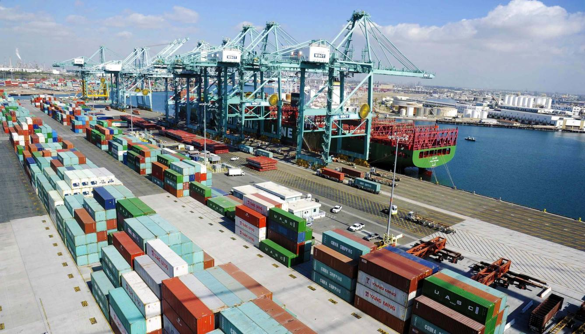
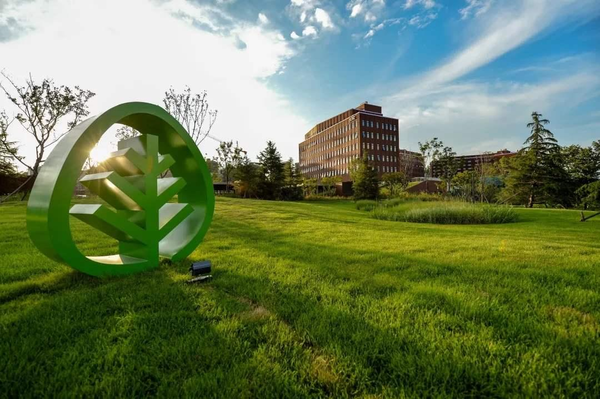

# 华为助天津港5G港口业务性能评估监测系统运行

----------

## 摘要

8月10日，华为官方发布消息称，公司已于近日携手天津移动成功完成天津港场桥与低时延的5G网络远程操控业务商用，并在业界首次实现5G港口业务性能评估监测系统运行，以推动天津港“5G智慧港口”建设。

目前，天津移动通过华为提供的5G端到端解决方案，在天津港实现5G网络覆盖，基于端到端5G SA独立组网和MEC下沉部署，天津港远程场桥港机操控不仅取代了传统光纤的传输方式，而且全程时延降至毫秒级，司机能够通过远程操控系统和全景高清摄像头传回的实时图像在操控室内实时控制码头上集装箱的转运作业。

在此基础上，华为联合天津移动在天津港引入了5G港口视频和控制类业务性能在线实时评估监测系统，改变以往系统管理缺失的情况。通过业务模拟和在线长期测试数据，有利于简化运维流程、提升运维效率，助力5G港口的智慧管理。

## 分析

基础设施建设是经济发展的底座，以“铁公基”为代表的“老基建”支撑了中国经济四十年的高速发展，成就了中国经济奇迹，相较于“老基建”，以5G、物联网、人工智能等新兴技术为代表的“新基建”将为我国实体经济的发展注入新动能，支撑下一个四十年经济向高质量发展的战略目标。

以案例中5G港口为例，港口作为海运和陆运的交接点，对区域经济发展起到重要的联动作用。当前全球港口面临劳动力成本攀升、劳动强度大、工作环境恶劣、人力短缺的难题，作为区域经济的新增长点，能够降本增效进行自动化改造成为全球港口共同的诉求。5G作为信息基础设施，它所具备的低时延、大带宽、高可靠特性为智慧港口建设赋予新动能，助力港口操作智能化、物流服务电商化、企业管理平台化，提升港口运营效率，推动港口业务的可持续发展，从而带动腹地经济的高质量增长。

## 比较案例

> 青岛国际经济合作区：打造可持续发展新样本

中德生态园是商务部设立的全国首家国际合作生态园区。自从中德生态园全面建设启动以来，始终坚持可持续、可复制、可推广的发展模式，并以国际化视角，建设成一个可持续发展的园区样本。

如今，这里集聚着中英、中法、中俄、中日韩、中芬、中瑞等多个国际合作园区，把“朋友圈”扩大到世界范围内的同时，瞄准高端产业和尖端科技，走出了一条可持续发展的道路。

先标准、后规划、再设计、后实施，国际经济合作区在建设中始终坚持这一理念。绿色施工、绿色建筑、绿色产业是可持续发展的必然要求。在引进项目时，园区坚持环保和可持续发展的理念，把目标瞄准世界范围内具有核心竞争力和定价权的引领产业，打造‘亦城亦乡、非城非乡’的产城融合示范区。

在这一理念的指导下，合作区先后以“德国+”引进高端产业融入中国发展，以“+德国”引进德国技术助推转型升级，先后与德国、英国、俄罗斯、芬兰、波兰、韩国6个国家的19个州市（地区）相关机构签署合作协议，引进西门子、大陆、正大制药等16个国家的企业430多家，初步形成了智能制造、生命健康、新能源新材料、高端装备制造等四大产业体系。

引进国外高端制造业同时，国内产业升级、新旧动能转换也在进行。芯恩、安润芯片封测等一系列项目落户园区，将解决山东省缺芯少魂的局面；智能制造产业链加速布局，海尔工业4.0、GE特冰等一批引领作用强的智能制造项目在园区建设或投产。

## 来源

<a href="https://www.iyiou.com/p/131231.html" target="_blank">点击打开</a>

## 图片

## 标签

5G、智慧城市，绿色工业、创新和基础设施（SDG9）

